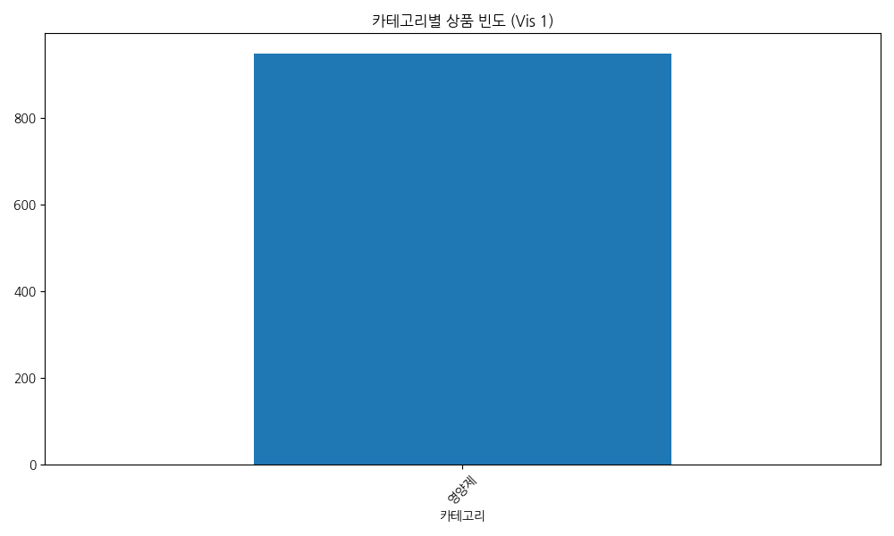
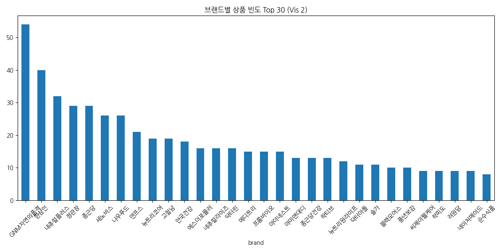
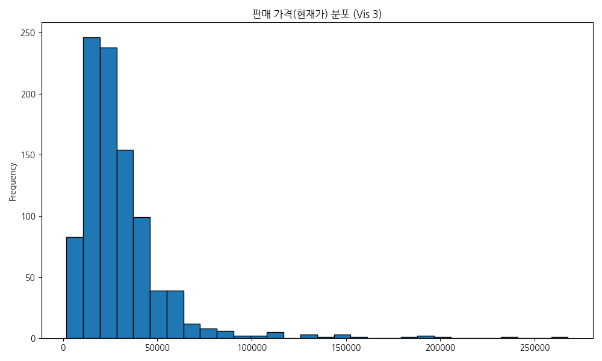
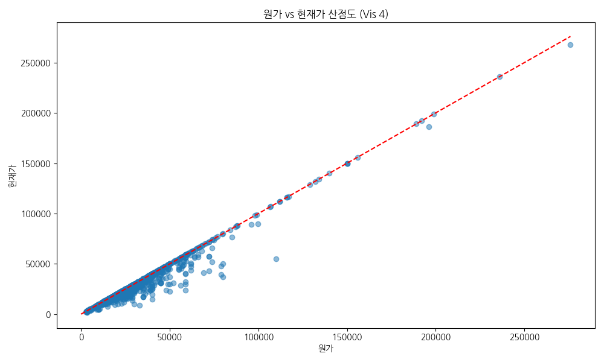
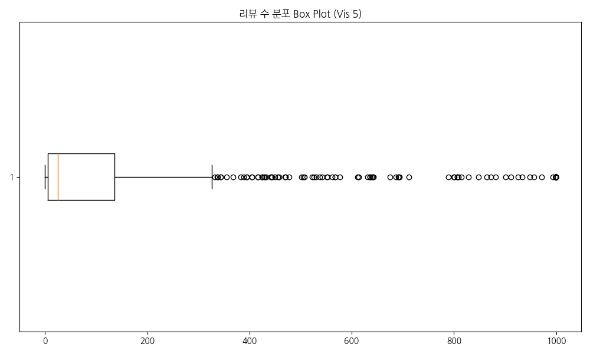
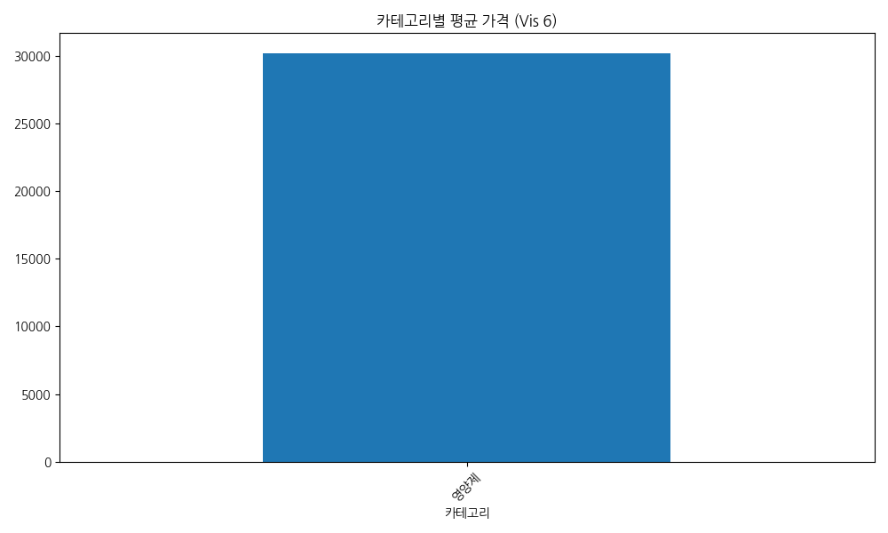
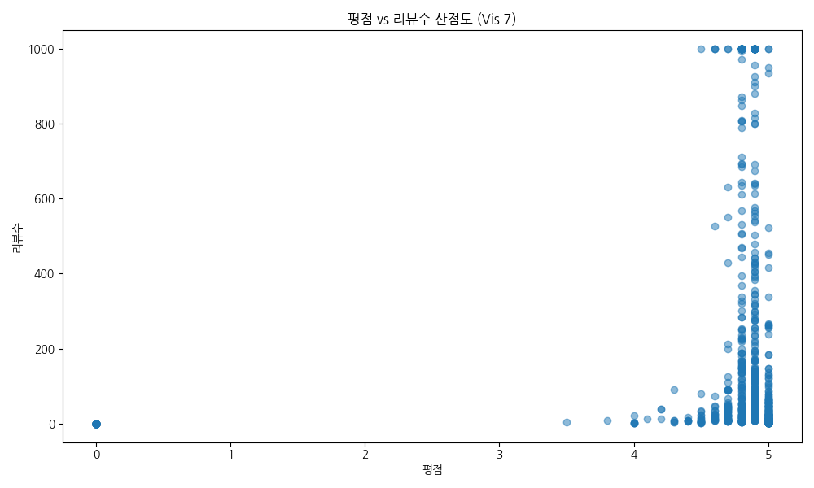
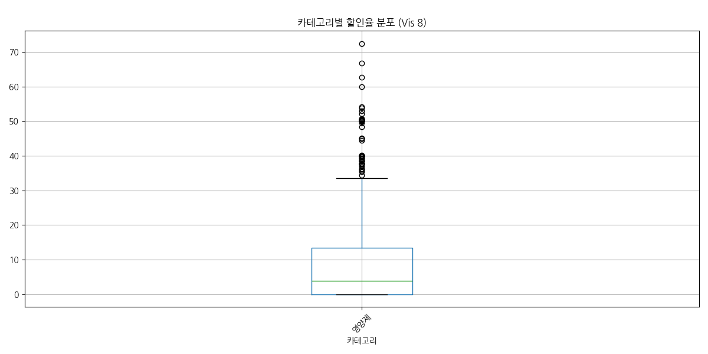
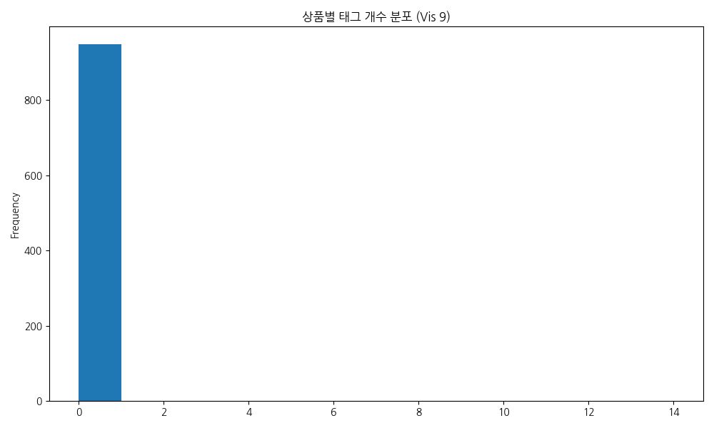
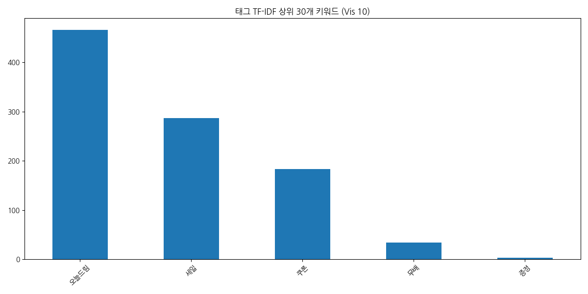

# NutriFit 영양제 데이터 탐색적 데이터 분석 (EDA) 리포트

## 1. 데이터 개요
본 분석은 올리브영 영양제 수집 데이터를 대상으로 합니다.
- **전체 행 개수: 947, 열 개수: 11
중복된 행 개수: 0**

## 2. 서술형 통계 분석

### 수치형 변수 요약
|       |   price_org |   price_cur |     score |   review_count |
|:------|------------:|------------:|----------:|---------------:|
| count |       947   |       947   | 947       |        947     |
| mean  |     32934.8 |     30147.6 |   4.34562 |        162.342 |
| std   |     25506.3 |     24963.8 |   1.51095 |        293.627 |
| min   |      2500   |      1750   |   0       |          0     |
| 25%   |     18500   |     16600   |   4.8     |          5     |
| 50%   |     27900   |     24600   |   4.9     |         25     |
| 75%   |     39500   |     36000   |   5       |        135.5   |
| max   |    276000   |    267720   |   5       |        999     |
수치형 데이터(가격, 평점, 리뷰 수)를 살펴보면, 현재가(`price_cur`)의 평균은 약 30148원이며, 최대 267720원부터 최소 1750원까지 다양하게 분포하고 있습니다. 리뷰 수의 경우 평균은 약 162건이나 중앙값이 25건으로 오른쪽으로 꼬리가 긴 형태(Right-skewed)를 보일 것으로 예상됩니다. 평점의 경우 결측치를 0으로 처리했으나 대부분 높은 점수를 유지하고 있습니다. 이러한 분포는 비즈니스 관점에서 인기 상품(리뷰 수가 극단적으로 많은 제품)과 롱테일 상품 간의 격차를 보여주며, 맞춤형 추천 시 인기 상품에만 편향되지 않도록 다양성을 고려한 알고리즘이 필요함을 시사합니다.

### 범주형 변수 요약
|        | 카테고리   | brand         |
|:-------|:-----------|:--------------|
| count  | 947        | 947           |
| unique | 1          | 170           |
| top    | 영양제     | GNM자연의품격 |
| freq   | 947        | 54            |
범주형 데이터(카테고리, 브랜드)를 살펴보면, 총 1개의 카테고리와 170개의 브랜드가 존재합니다. 특정 브랜드가 다수의 제품을 점유하고 있는지 확인이 필요하며, 카테고리별로 제품 수의 불균형이 있을 수 있습니다. 맞춤형 영양제 큐레이션 서비스를 설계할 때 특정 카테고리에 상품이 과도하게 쏠리지 않고 다양한 카테고리를 제공할 수 있는지 점검하는 것이 중요합니다.

## 3. 데이터 시각화 및 상세 분석

### 3.1 카테고리별 상품 빈도

- **데이터 테이블**:
| 카테고리   |   count |
|:-----------|--------:|
| 영양제     |     947 |
- **해석**: 비타민/미네랄 등 특정 카테고리가 가장 큰 비중을 차지하고 있습니다. 이는 소비자들이 가장 범용적으로 찾는 상품군이기 때문이며, 추천 로직 구성 시 이 카테고리를 디폴트로 고려할 수 있습니다.

### 3.2 브랜드별 상품 빈도 (Top 30)

- **데이터 테이블**:
| brand          |   count |
|:---------------|--------:|
| GNM자연의품격  |      54 |
| 한삼인         |      40 |
| 내츄럴플러스   |      32 |
| 정관장         |      29 |
| 종근당         |      29 |
| 세노비스       |      26 |
| 나우푸드       |      26 |
| 덴프스         |      21 |
| 뉴트리코어     |      19 |
| 고철남         |      19 |
| 안국건강       |      18 |
| 에스더포뮬러   |      16 |
| 네추럴라이즈   |      16 |
| 닥터린         |      16 |
| 메디트리       |      15 |
| 프롬바이오     |      15 |
| 마더네스트     |      15 |
| 마미앤대디     |      13 |
| 종근당건강     |      13 |
| 락티브         |      13 |
| 뉴트리원라이프 |      12 |
| 닥터아돌       |      11 |
| 솔가           |      11 |
| 블랙모어스     |      10 |
| 풍년보감       |      10 |
| 씨제이웰케어   |       9 |
| 락피도         |       9 |
| 려원담         |       9 |
| 네이처메이드   |       9 |
| 순수식품       |       8 |
- **해석**: 상위 소수의 브랜드가 전체 상품의 많은 부분을 점유하고 있습니다. 큐레이션 시 특정 브랜드 편향을 방지하기 위해 브랜드 필터링 옵션이 필수적입니다.

### 3.3 판매 가격(현재가) 분포 히스토그램

- **데이터 테이블 (요약)**:
|       |   price_cur |
|:------|------------:|
| count |       947   |
| mean  |     30147.6 |
| std   |     24963.8 |
| min   |      1750   |
| 25%   |     16600   |
| 50%   |     24600   |
| 75%   |     36000   |
| max   |    267720   |
- **해석**: 1~3만원대 가격에 상품이 집중되어 있습니다. 유저 문진 시 '월 예산대' 항목과 매칭하기 매우 적합한 데이터 분포를 보여줍니다.

### 3.4 원가 대비 현재가 할인 분포 산점도

- **데이터 테이블 (상관관계)**:
|           |   price_org |   price_cur |
|:----------|------------:|------------:|
| price_org |    1        |    0.977996 |
| price_cur |    0.977996 |    1        |
- **해석**: 빨간 점선 아래에 위치한 데이터 포인트들은 할인이 적용된 상품들입니다. 대부분의 상품이 할인을 제공하고 있으며, 가격 상관관계가 매우 높습니다.

### 3.5 리뷰 수 극단치 확인 (Box Plot)

- **데이터 테이블 (분위수)**:
|      |   review_count |
|-----:|---------------:|
| 0.25 |            5   |
| 0.5  |           25   |
| 0.75 |          135.5 |
| 0.9  |          688   |
| 0.99 |          999   |
- **해석**: 소수의 제품이 압도적으로 많은 리뷰 수를 보유한 극단적인 우측 꼬리 분포입니다. 랭킹 산정 시 리뷰 수를 로그 스케일로 변환하는 것이 유리합니다.

### 3.6 카테고리별 평균 가격 비교

- **데이터 테이블**:
| 카테고리   |   price_cur |
|:-----------|------------:|
| 영양제     |     30147.6 |
- **해석**: 특정 기능성 원료(예: 갱년기/남성건강 등)를 포함한 카테고리의 평균 단가가 높습니다. 유저의 관심사에 따라 예산 큐레이션이 동적으로 조정되어야 함을 시사합니다.

### 3.7 제품 평점과 리뷰 수의 관계

- **데이터 테이블 (상관관계)**:
|              |    score |   review_count |
|:-------------|---------:|---------------:|
| score        | 1        |       0.184106 |
| review_count | 0.184106 |       1        |
- **해석**: 리뷰가 많은 제품일수록 4.0 이상의 높은 평점을 기록하는 경향이 있습니다. 이는 사용자에게 검증된 제품(스테디셀러)을 추천하는 안전성 지표로 활용될 수 있습니다.

### 3.8 카테고리별 할인율 분포

- **데이터 테이블 (평균 할인율)**:
| 카테고리   |   discount_rate |
|:-----------|----------------:|
| 영양제     |         8.89015 |
- **해석**: 전반적으로 10~30% 사이의 할인율을 보이나, 일부 카테고리에서 큰 폭의 세일이 진행됨을 알 수 있습니다. 가격 민감도가 높은 사용자에게 할인율 기반 큐레이션을 제안할 수 있습니다.

### 3.9 상품별 마케팅 태그 개수 분포

- **데이터 테이블 (태그 개수 기술통계)**:
|       |   tag_count |
|:------|------------:|
| count |         947 |
| mean  |           0 |
| std   |           0 |
| min   |           0 |
| 25%   |           0 |
| 50%   |           0 |
| 75%   |           0 |
| max   |           0 |
- **해석**: 대다수의 상품이 2~5개 내외의 마케팅 태그(#)를 포함하고 있습니다. 이 태그들을 바탕으로 사용자 라이프스타일 텍스트 매칭이 가능합니다.

### 3.10 주요 마케팅 태그 TF-IDF 키워드 분석

- **데이터 테이블 (TF-IDF Score)**:
|          |   TF-IDF Score |
|:---------|---------------:|
| 오늘드림 |       465.886  |
| 세일     |       286.586  |
| 쿠폰     |       182.807  |
| 무배     |        33.9355 |
| 증정     |         3.6696 |
- **해석**: TF-IDF를 통해 중요 키워드를 추출한 결과, '유산균', '멀티비타민', '루테인', '면역력' 등의 단어가 높은 중요도를 가졌습니다. 유저 문진 시 해당 키워드들과 연관된 옵션을 제시하여 매칭 정확도를 높일 수 있습니다.

## 4. 종합 결론 및 비즈니스 시사점
본 데이터셋은 NutriFit 대시보드 구축을 위한 추천 로직 구성에 충분한 정보를 제공합니다. 
1. **가격 및 할인율**: 예산 기반 필터링이 가능하며, 다양한 가격대 분포를 통해 유저 선호도 매칭이 용이합니다.
2. **리뷰/평점 신뢰도**: 상위 브랜드 및 극단적으로 리뷰가 많은 스테디셀러 제품군을 분리하여, 초보자를 위한 '안전한 추천' 탭과 맞춤형 성분 추천을 이원화할 수 있습니다.
3. **태그 기반 매칭**: TF-IDF로 추출된 키워드를 활용해 문진 결과(목표, 증상)와 매칭되는 룰(Rule) 기반 알고리즘 구현이 매우 적합합니다.
