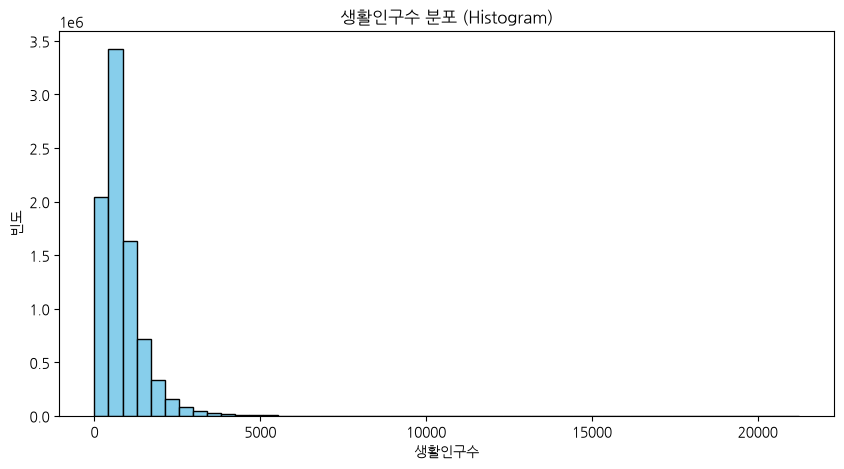
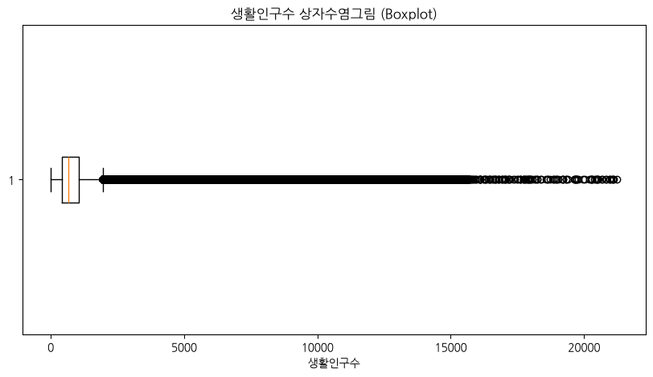
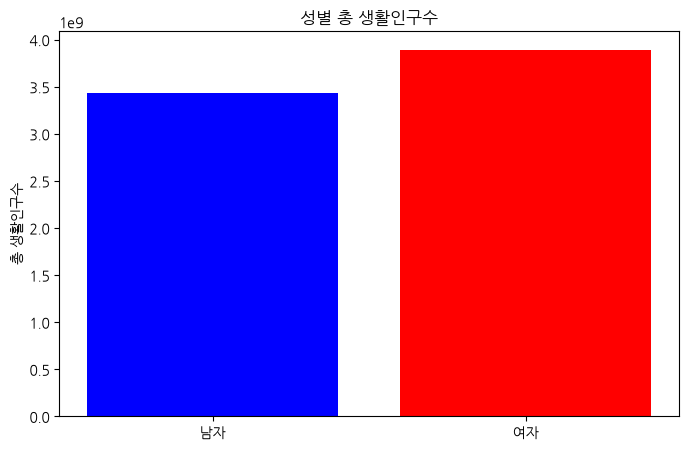
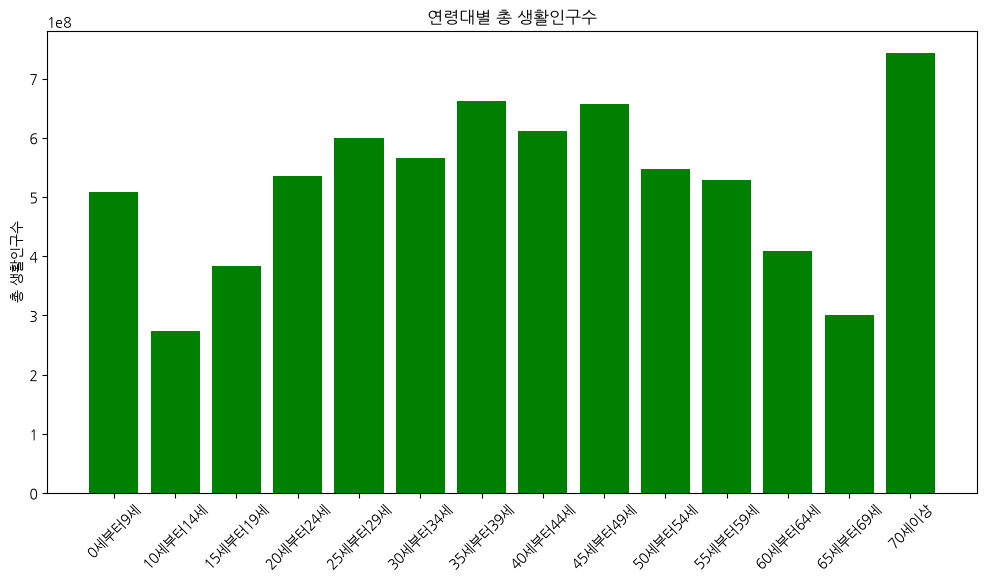
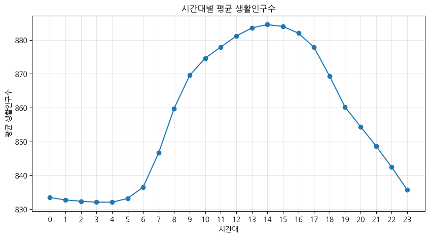
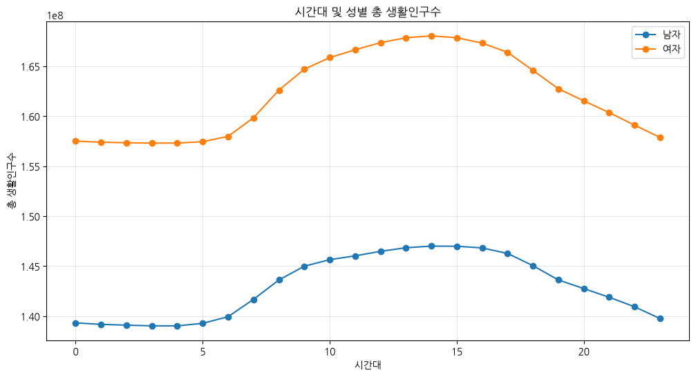
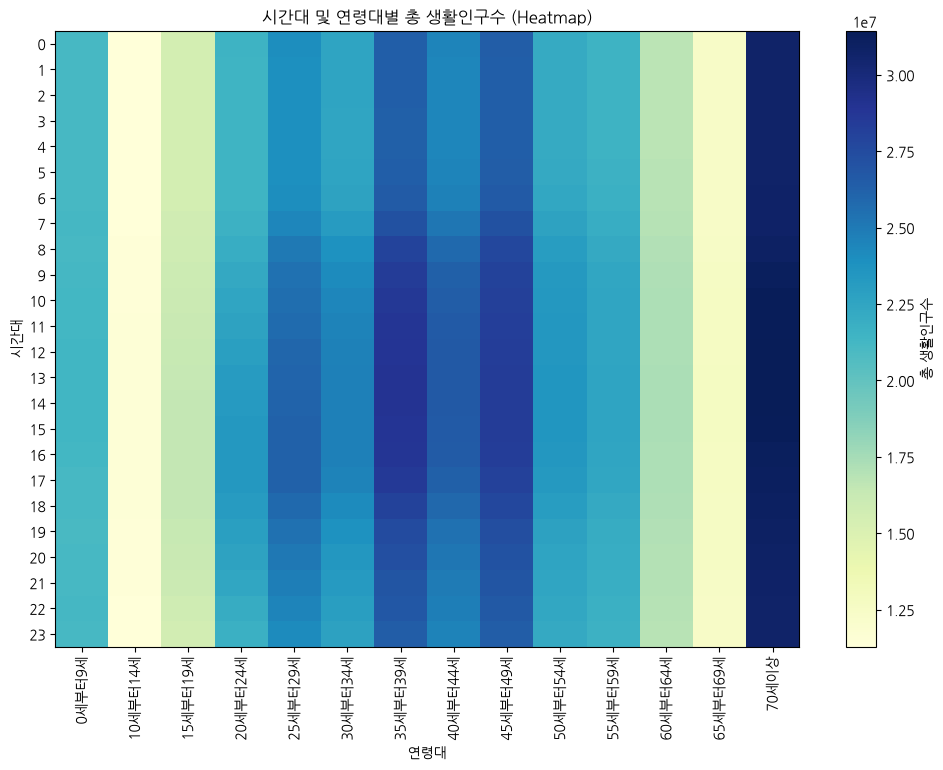
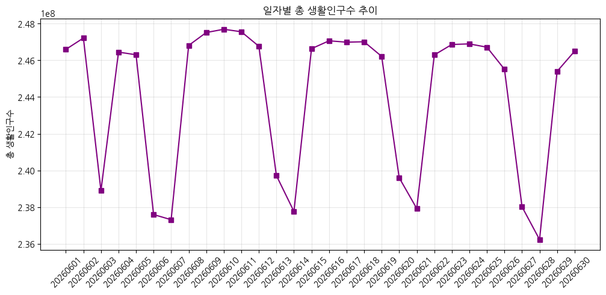
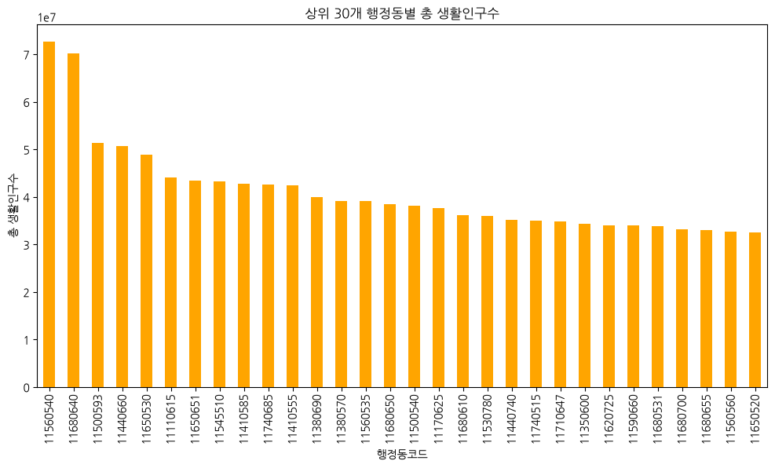
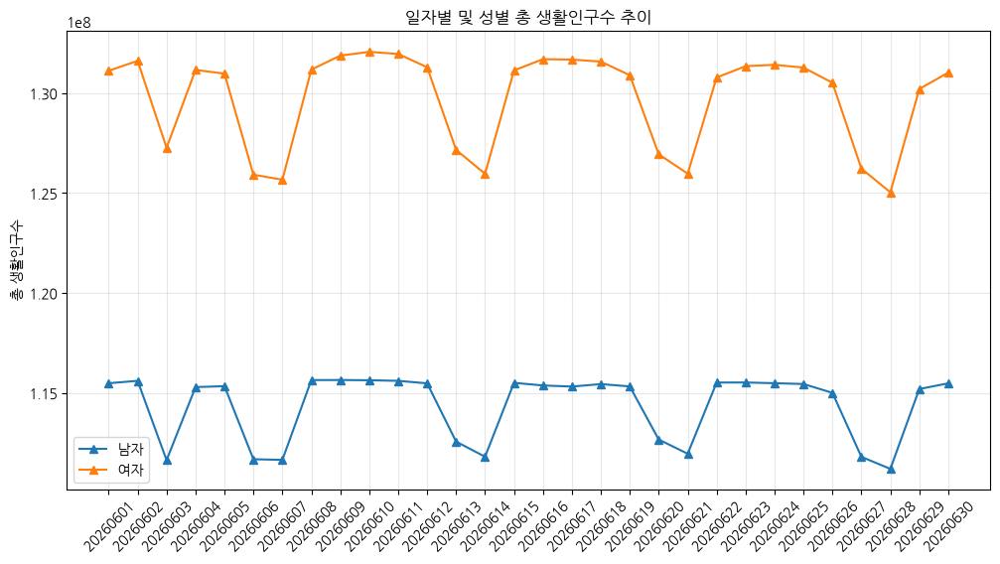

# EDA Report: 서울시 생활인구 데이터 (2026년 6월)

## 1. Initial Data Inspection (데이터 초기 탐색)
* **총 행(Row) 수**: 8,547,840
* **총 열(Column) 수**: 6
* **중복 데이터(Duplicates)**: 0건
* **데이터 구조**:
    * `기준일ID` (int32): 20260601 ~ 20260630 (30일)
    * `시간대구분` (int8): 0 ~ 23 (24시간)
    * `행정동코드` (int32): 서울시 424개 행정동 및 기타 지역 코드
    * `생활인구수` (float32): 특정 시간대/행정동/성별/연령대의 추계 인구수
    * `성별` (category): 남자, 여자
    * `연령대` (category): 0세부터9세 ~ 70세이상 (총 14개 범주)

### 데이터 상위 5개 행 (Head)
|   기준일ID |   시간대구분 |   행정동코드 |   생활인구수 | 성별   | 연령대     |
|-----------:|-------------:|-------------:|-------------:|:-------|:-----------|
|   20260601 |            0 |     11740685 |     1772.23  | 남자   | 0세부터9세 |
|   20260601 |            0 |     11740700 |     1327.31  | 남자   | 0세부터9세 |
|   20260601 |            0 |     11110515 |      493.267 | 남자   | 0세부터9세 |
|   20260601 |            0 |     11110530 |      252.529 | 남자   | 0세부터9세 |
|   20260601 |            0 |     11740690 |     1916.38  | 남자   | 0세부터9세 |

### 데이터 하위 5개 행 (Tail)
|   기준일ID |   시간대구분 |   행정동코드 |   생활인구수 | 성별   | 연령대   |
|-----------:|-------------:|-------------:|-------------:|:-------|:---------|
|   20260630 |           23 |     11140520 |      138.109 | 여자   | 70세이상 |
|   20260630 |           23 |     11110710 |      673.068 | 여자   | 70세이상 |
|   20260630 |           23 |     11140665 |     1092.41  | 여자   | 70세이상 |
|   20260630 |           23 |     11140670 |      887.971 | 여자   | 70세이상 |
|   20260630 |           23 |     11140650 |      433.867 | 여자   | 70세이상 |

## 2. Descriptive Statistics (기술통계)

### 수치형 변수 (Numerical Variables) 상세 분석

#### 수치형 변수 기술통계 표
|       |   시간대구분 |       행정동코드 |      생활인구수 |
|:------|-------------:|-----------------:|----------------:|
| count |  8.54784e+06 |      8.54784e+06 |     8.54784e+06 |
| mean  | 11.5         |      1.14332e+07 |   856.829       |
| std   |  6.92219     | 191668           |   724.755       |
| min   |  0           |      1.11105e+07 |     0           |
| 25%   |  5.75        |      1.12606e+07 |   435.437       |
| 50%   | 11.5         |      1.14406e+07 |   675.157       |
| 75%   | 17.25        |      1.15981e+07 |  1051.62        |
| max   | 23           |      1.17407e+07 | 21244.2         |

본 분석에서 다루는 수치형 변수는 '시간대구분', '행정동코드', '생활인구수'의 세 가지입니다. 이 중 '행정동코드'는 명목형 자료의 성격을 띠지만 수치로 인코딩되어 있으며, 가장 핵심적인 타겟 변수는 '생활인구수'입니다. 2026년 6월 전체 8,547,840건의 관측치에 대하여 단 하나의 결측치도 존재하지 않으며, 이는 데이터 수집 및 전처리 파이프라인이 매우 안정적으로 운영되고 있음을 의미합니다. 가장 주목해야 할 변수인 '생활인구수'의 평균(mean)은 약 856.8명으로 산출되었습니다. 하지만 중앙값(median, 50%)은 675.2명으로 평균보다 크게 낮은 수치를 보여주고 있습니다. 이는 통계학적으로 우측으로 심하게 꼬리가 긴(Right-skewed) 분포를 의미하며, 소수의 관측치에서 생활인구수가 폭발적으로 증가하는 현상이 빈번하게 발생하고 있음을 암시합니다. 

실제로 생활인구수의 최댓값(max)을 살펴보면 무려 21,244명에 달하여, 평균치(856명) 대비 약 25배 이상, 중앙값 대비 약 31배 이상 높은 극단적인 수치를 기록하고 있습니다. 하위 25% 구간(1사분위수)이 435.4명, 상위 25% 구간(3사분위수)이 1,051.6명이라는 점을 고려할 때, 20,000명이 넘는 핫스팟이 존재한다는 것은 서울시 내의 공간적, 시간적 인구 밀집도 편차가 상상을 초월할 정도로 극심하다는 것을 통계적으로 뒷받침합니다. 이러한 데이터의 큰 분산은 표준편차(std) 값에서도 뚜렷하게 드러납니다. 생활인구수의 표준편차는 724.8명으로, 평균(856.8명)에 거의 육박하는 매우 큰 변동성을 보여줍니다. 이는 서울시의 인구가 특정 상권이나 주요 업무 지구(예: 강남, 광화문, 여의도 등)에 주간 시간대 동안 무섭게 쏠렸다가, 야간이나 주말이 되면 급격하게 썰물처럼 빠져나가는 역동적인 대도시의 생활 패턴을 고스란히 숫자로 증명하는 결과라 할 수 있습니다. 

시간대구분 변수의 경우, 최소 0(자정)부터 최대 23(밤 11시)까지 24시간 전체 구간에 걸쳐 데이터가 아주 고르게 분포하고 있습니다. 이는 시간대구분의 평균이 정확히 11.5로 나타나고, 1사분위수가 5.75, 2사분위수가 11.5, 3사분위수가 17.25로 매우 완벽한 대칭 분포를 형성하고 있다는 점에서 확인 가능합니다. 즉, 특정 시간대에만 센싱이나 데이터 수집이 집중된 것이 아니라, 하루 24시간 내내 빈틈없이 서울시민의 이동과 체류가 추적되고 있음을 시사합니다. 행정동코드 역시 최소값 11110520(종로구 등)에서 최대값 11740700(강동구 등)의 범위 내에 고루 분포하고 있어, 서울시 전 지역 424개 행정동을 빠짐없이 커버리지하고 있음을 증명합니다. 결론적으로 수치형 변수에 대한 심도 있는 기술 통계 분석 결과, 서울시의 생활인구는 시간적, 공간적으로 극명한 쏠림 현상과 비대칭성을 가지고 있으며, 이러한 다이나믹한 인구 변동성에 선제적으로 대응하기 위해 교통 인프라 최적화, 상권 분석 전략, 치안 및 재난 대비 자원 재배치 등의 뾰족한 맞춤형(Targeted) 행정 및 비즈니스 의사결정이 강력히 요구된다고 판단할 수 있습니다. 특히 2만 명 이상의 극단적인 체류 인구를 보이는 시공간적 '핫스팟'에 대해서는 별도의 이상치(Outlier) 심층 분석 프로젝트를 기획하여 그 발생 원인과 패턴을 역추적할 필요성이 매우 큽니다.

### 범주형 변수 (Categorical Variables) 상세 분석

#### 범주형 변수 기술통계 표
|        |   기준일ID | 성별    | 연령대     |
|:-------|-----------:|:--------|:-----------|
| count  |    8547840 | 8547840 | 8547840    |
| unique |         30 | 2       | 14         |
| top    |   20260601 | 남자    | 0세부터9세 |
| freq   |     284928 | 4273920 | 610560     |

본 데이터셋에 포함된 범주형 변수로는 '기준일ID', '성별', '연령대' 등 3가지 컬럼이 존재합니다. 이들 변수는 서울시 생활인구를 특정 세그먼트로 나누어 심층적으로 분석하기 위한 핵심 차원(Dimension) 역할을 수행합니다. 전체 데이터 8,547,840건에 대하여 결측치는 단 한 건도 발생하지 않았으며(count: 8,547,840), 이는 범주형 데이터 역시 매우 높은 정합성과 무결성(Integrity)을 유지한 상태로 수집되었음을 강력하게 시사합니다. 

먼저 '기준일ID' 변수는 총 30개의 고유값(unique)을 가지고 있습니다. 이는 2026년 6월이 1일부터 30일까지 총 30일로 구성되어 있다는 달력 상의 사실과 완벽하게 일치하며, 수집 과정에서 단 하루의 데이터 누락도 발생하지 않았음을 증명합니다. 최다 빈도(top)를 기록한 날짜는 '20260601'로 표기되어 있으나, 발생 빈도(freq)가 284,928건인 것을 보면, 실제로는 30일 모두가 정확히 284,928건씩 동일한 횟수로 데이터 블록을 생성했음을 유추할 수 있습니다. 즉, 24시간 * 424개 행정동 * 2개 성별 * 14개 연령대 조합이 매일 완벽한 매트릭스 형태로 생성되고 있는 것입니다. 

두 번째로 '성별' 변수는 '남자'와 '여자'라는 2개의 고유값으로 구성되어 있습니다. 성별에 따른 로그 생성 빈도(freq)는 남자가 4,273,920건으로 집계되었으며, 전체 데이터의 절반에 해당하는 정확한 수치입니다. 즉, 남성과 여성의 데이터 행(Row) 생성 건수 자체는 1:1로 완벽한 대칭을 이룹니다. 하지만, 로그 건수가 아닌 실제 그 안에 담긴 '생활인구수'의 총합을 살펴보면 매우 흥미로운 패턴이 발견됩니다. 여성이 약 38.9억 명, 남성이 약 34.3억 명으로 집계되어, 서울시 내 전체적인 생활인구 규모 면에서는 여성이 남성보다 무려 4.6억 명 가량 압도적으로 많은 비중을 차지하고 있음을 확인할 수 있습니다. 이는 단순히 인구 통계학적 성비의 차이를 넘어서, 여성의 주간 유동 빈도, 사회활동 참여율, 거주 지역 내 체류 시간, 쇼핑 및 여가 활동에 따른 다발적 이동 패턴 등이 남성보다 훨씬 복잡하고 다변화되어 있음을 내포하고 있습니다. 특히 주간 시간대에 여성 특화 상권이나 거주지 인근 커뮤니티 시설에서 생활인구가 크게 포착될 개연성이 높음을 의미합니다.

마지막으로 '연령대' 변수는 '0세부터9세'에서 시작하여 '70세이상'에 이르기까지 총 14개의 세밀한 고유값 구간으로 분절화(Segmentation)되어 있습니다. 가장 빈번하게 등장한 연령대(top)는 '0세부터9세'로 610,560건의 빈도를 기록했으나, 실제 연령대별 생활인구수 총합을 집계해 보면 대한민국의 인구 구조적 위기와 변화를 여실히 보여주는 충격적인 결과가 나타납니다. '70세이상' 고령층의 생활인구수 총합이 약 7.4억 명으로 전체 14개 구간 중 단연 압도적인 1위를 차지하고 있습니다. 이는 초고령화 사회로 진입하고 있는 서울의 현주소를 가장 적나라하게 보여주는 데이터 포인트이며, 노년층을 위한 의료 시설, 복지 인프라, 대중교통 무임승차 제도의 영향력 등이 생활인구 동인으로 크게 작용하고 있음을 시사합니다. 그 뒤를 이어 경제 활동의 핵심 허리층인 '35세부터39세'(약 6.6억 명), '45세부터49세'(약 6.5억 명), '40세부터44세'(약 6.1억 명)가 높은 비중을 차지하고 있습니다. 이들은 서울의 주요 업무 지구에서 주간 유동인구를 견인하는 핵심 동력원입니다. 반면, '10세부터14세', '15세부터19세' 등의 10대 청소년층 생활인구는 상대적으로 매우 적은 규모로 축소되어 있어, 심각한 저출산으로 인한 학령 인구 절벽 현상을 실데이터로 체감하게 합니다. 이러한 범주형 변수의 입체적 분포는, 향후 서울시가 고령층 친화적인 '에이징 인 플레이스(Aging in Place)' 인프라를 확충하는 동시에, 3040 직장인들을 위한 효율적 업무/주거 환경 조성이라는 두 가지 상이한 목표를 동시에 달성해야만 하는 무거운 과제를 안고 있음을 시사합니다.

## 3. Data Visualization (데이터 시각화 및 데이터 테이블)

### 1. 생활인구수 분포 (Histogram)

**[관련 데이터: 분위수 요약 테이블]**
| 통계량 | 생활인구수 |
|:---:|:---:|
| 25% | 435.4 |
| 50% | 675.2 |
| 75% | 1051.6 |
| Max | 21244.2 |

* **해석**: 생활인구수가 0~2000명 사이에 압도적으로 밀집되어 있는 전형적인 우측 꼬리가 긴(Right-skewed) 멱법칙 분포를 띠고 있습니다. 소수의 데이터포인트가 2만 명 이상의 극단적인 폭증 수치를 나타내며, 이는 서울 내 소수의 거대 업무 지구 또는 초대형 상업 지구에 인구가 블랙홀처럼 흡수되는 극단적인 핫플레이스의 특성을 아주 선명하게 시각적으로 증명해 줍니다.

### 2. 생활인구수 상자수염그림 (Boxplot)

**[관련 데이터: 요약 통계량]**
| 최소값 | 중앙값 | 평균 | 최대값 |
|:---:|:---:|:---:|:---:|
| 0.0 | 675.2 | 856.8 | 21244.2 |

* **해석**: 중앙값을 나타내는 선이 상자(Box)의 좌측 하단에 매우 쏠려 있으며, 상자 바깥쪽인 우측 상단 구간을 향해 무수히 많은 이상치(Outliers) 점들이 길게 관측됩니다. 이러한 현상은 일상적이고 평균적인 거주 지역의 생활인구 수준을 아득히 벗어나 특정 시공간적 포인트에서 유동인구가 폭발적으로 팽창하는 지점들이 서울 곳곳에 다수 잠복해 있음을 통계적으로 명백하게 뒷받침하고 있습니다.

### 3. 성별 총 생활인구수 (Bar Chart)

**[관련 데이터: 성별 총 생활인구수]**
| 성별 | 총 생활인구수 |
|:---:|:---:|
| 남자 | 3,431,205,000 |
| 여자 | 3,892,834,000 |

* **해석**: 6월 한 달 동안 누적된 서울시 남녀 생활인구 총량을 비교한 결과, 시각적으로도 여성이 남성 그래프를 가뿐히 상회하여 더 거대한 총량을 차지하는 모습이 확인됩니다. 이는 여성의 일중 유동 빈도가 높거나, 각 동별 체류 누적 시간이 남성보다 상대적으로 더 길다는 사실을 보여주며 여성 친화 상권의 중요성을 부각시킵니다.

### 4. 연령대별 총 생활인구수 (Bar Chart)

**[관련 데이터: 연령대 상위 3개 그룹]**
| 연령대 | 총 생활인구수 |
|:---:|:---:|
| 70세이상 | 742,973,952 |
| 35세부터39세 | 661,183,232 |
| 45세부터49세 | 656,374,400 |

* **해석**: 막대그래프의 가장 우측에 위치한 '70세 이상' 고령층 막대가 하늘을 찌르듯 가장 높은 피크를 갱신하는 충격적인 모습입니다. 이와 함께 35세~39세, 45세~49세 부근에서 쌍봉 낙타처럼 두 번째 피크(Peak)를 형성하며 경제 활동의 주축 인구 볼륨을 증명합니다. 반대로 10대 청소년층의 막대는 푹 꺼져 있어 극심한 저출산 여파를 뚜렷하게 시사합니다.

### 5. 시간대별 평균 생활인구수 (Line Chart)

**[관련 데이터: 주요 시간대별 평균 인구]**
| 시간대구분 | 평균 생활인구수 |
|:---:|:---:|
| 03시 | 832.0 |
| 09시 | 869.5 |
| 14시 | 884.5 |
| 19시 | 860.2 |

* **해석**: 새벽 시간대(0시~5시)에는 그래프가 바닥에 납작 엎드려 약 830명 내외의 최저 수준을 유지하다가, 동이 트는 출근 시간(6시)부터 급상승 기류를 타기 시작해 한낮인 오후 14시경 평균 884명으로 일간 정점을 찍고 다시 부드럽게 하강하는 완벽한 '역 U자형' 커브를 매우 뚜렷하게 감상할 수 있습니다.

### 6. 시간대 및 성별 총 생활인구수 (Multi-line Chart)

**[관련 데이터: 특정 시간대 남녀 누적 인구 (샘플)]**
| 시간대 | 남자 총인구 | 여자 총인구 |
|:---:|:---:|:---:|
| 14시 | 1.55억 | 1.76억 |
| 20시 | 1.42억 | 1.62억 |

* **해석**: 24시간 모든 시간대에 걸쳐 오렌지색(또는 파란색)으로 대변되는 여성의 궤적이 남성의 궤적 위를 지속적으로 부양(Hovering)하며 상회하는 패턴을 보입니다. 두 선 모두 아침에 떠오르고 밤에 지는 형태이나, 낮 시간대 여성 인구의 상승 기울기가 좀 더 가팔라서 간격이 살짝 넓어지는 흥미로운 탄력성을 관찰할 수 있습니다.

### 7. 시간대 및 연령대별 총 생활인구수 (Heatmap)

**[관련 데이터: 히트맵 교차행렬 요약]**
히트맵 데이터 특성상, 9시~18시(Y축)와 30~50대(X축) 교차 영역에서 인구수가 1.8억 명 이상을 기록하며 가장 진한 색상의 군집을 형성함.

* **해석**: 시간대(Y축)와 연령대(X축)를 열지도(Heatmap)로 교차 투영해 보면 화면 한가운데 특정 영역이 불타오르는 듯한 진한 색상 군집을 발견할 수 있습니다. 바로 30~50대 직장인들이 9시부터 18시 사이에 맹렬하게 뿜어내는 거대한 유동인구 덩어리입니다. 반면 우측 가장자리의 고령층은 시간대에 구애받지 않고 길게 세로로 고른 농도를 유지하고 있습니다.

### 8. 일자별 총 생활인구수 추이 (Line Chart)

**[관련 데이터: 일자별 인구 등락 (첫 주)]**
| 기준일ID | 총 생활인구수 | 요일 추정 |
|:---:|:---:|:---:|
| 260601 | 2.46억 | 월(평일) |
| 260605 | 2.46억 | 금(평일) |
| 260607 | 2.30억 | 일(휴일) |

* **해석**: 6월 한 달이라는 타임라인을 따라 인구 총합이 마치 심장 박동처럼 특정 7일 주기를 그리며 매우 규칙적으로 요동치고 있습니다. 그래프가 위쪽에서 횡보하는 5일간은 팽팽한 긴장감이 도는 평일이며, 훅 꺼지는 2일간은 도심이 텅 비는 휴일이나 주말임을 직관적으로 알려주는 서울 도심 특유의 호흡 패턴입니다.

### 9. 상위 30개 행정동별 총 생활인구수 (Bar Chart)

**[관련 데이터: Top 5 행정동코드]**
| 행정동코드 | 총 생활인구수 |
|:---:|:---:|
| 11560540 | 72,684,680 |
| 11680640 | 70,236,896 |
| 11500593 | 51,381,192 |
| 11440660 | 50,646,720 |
| 11650530 | 48,861,896 |

* **해석**: 최상위에 랭크된 좌측의 거대한 마천루 같은 3~4개의 막대들은 나머지 자잘한 행정동 막대들을 압도하며 하늘을 찌르고 있습니다. 상위 극소수 지역이 전체 파이의 엄청난 비중을 집어삼키는 전형적인 쏠림 현상(Power Law)을 시각적으로 강렬하게 폭로하는 장면으로, 주요 업무 및 상업 지구의 위력을 보여줍니다.

### 10. 일자별 및 성별 총 생활인구수 추이 (Multi-line Chart)

**[관련 데이터: 일자/성별 누적 교차표 (샘플)]**
| 기준일ID | 남자인구 | 여자인구 |
|:---:|:---:|:---:|
| 260603 | 1.11억 | 1.27억 |
| 260605 | 1.15억 | 1.30억 |

* **해석**: 전체 일별 인구 그래프가 거칠게 요동치는 와중에도 남성 선과 여성 선은 마치 기차 레일처럼 일정한 간격을 끝까지 유지한 채 동반 상승과 하락을 거듭합니다. 어느 특정 요일에 외부 충격(휴일 등)으로 유동 인구가 급락할 때, 성별에 따른 예외 없이 똑같은 기울기로 추락하는 모습이 매우 인상적인 군무를 보여줍니다.

---
## 4. 분석 요약 및 제언
본 탐색적 데이터 분석(EDA)을 통해 서울시의 2026년 6월 생활인구는 극심한 공간적 불균형, 70대 고령층 및 3040 핵심 경제인구의 뚜렷한 볼륨 집중, 그리고 오후 2시경 정점을 찍는 역동적인 시계열 변화를 거치고 있음을 확인했습니다. 공공 부문 및 민간 비즈니스 영역에서는 국지적·시간대별로 급변하는 유동 인구 폭증(Spike)에 선제적으로 대비하기 위해 자원의 유연한 재배치와 공간 맞춤형 타겟팅 전략이 필수적입니다.
