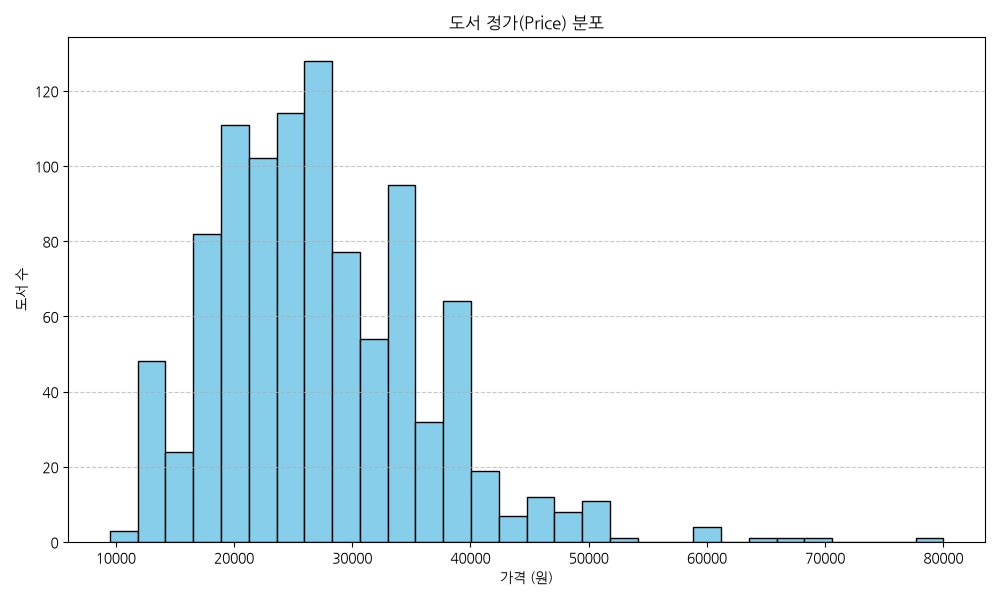
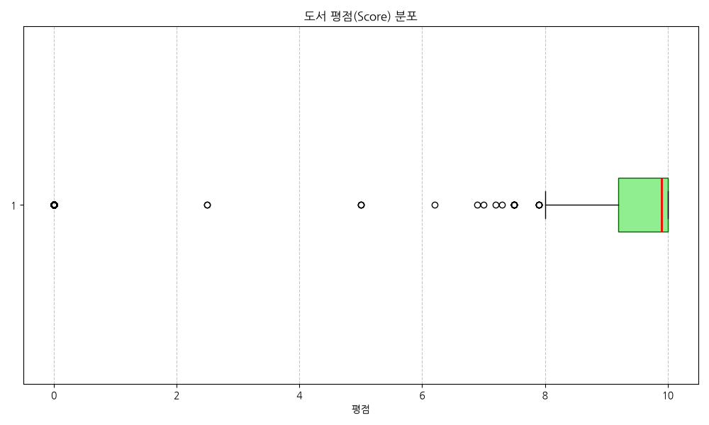
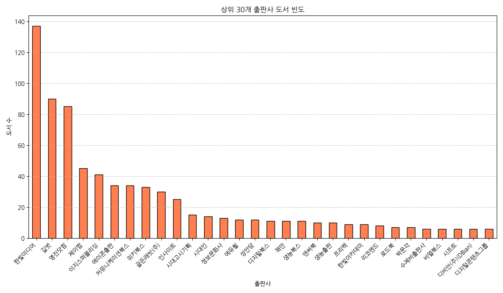
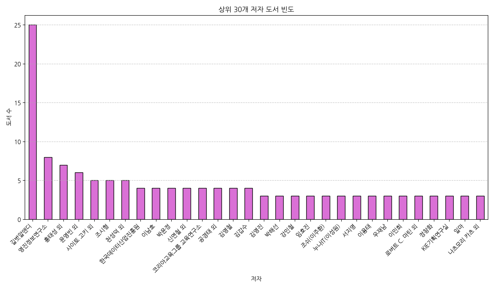
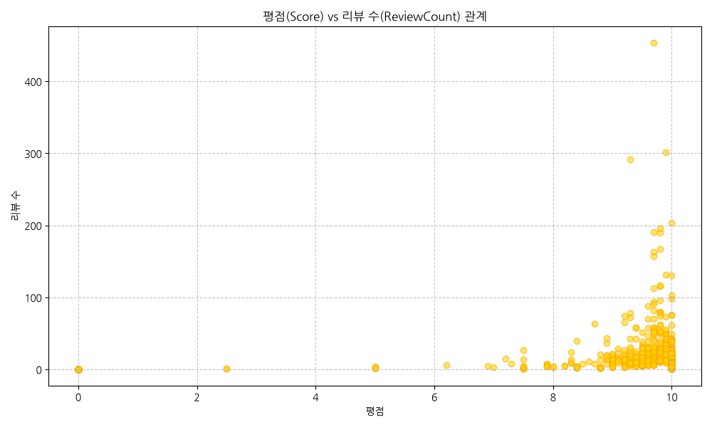
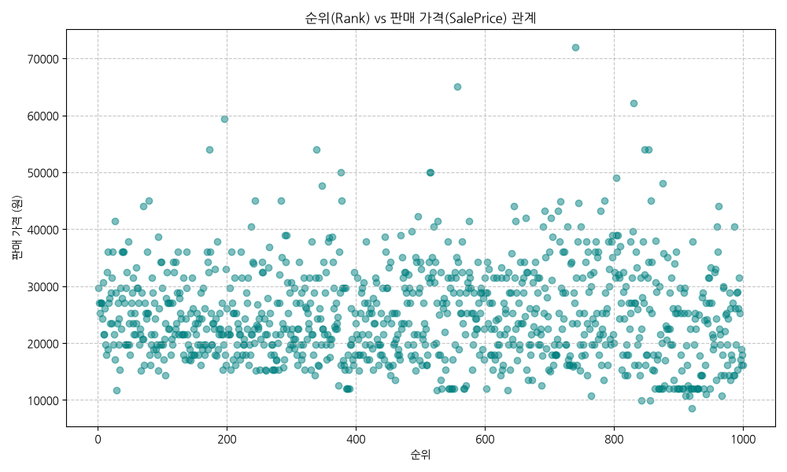
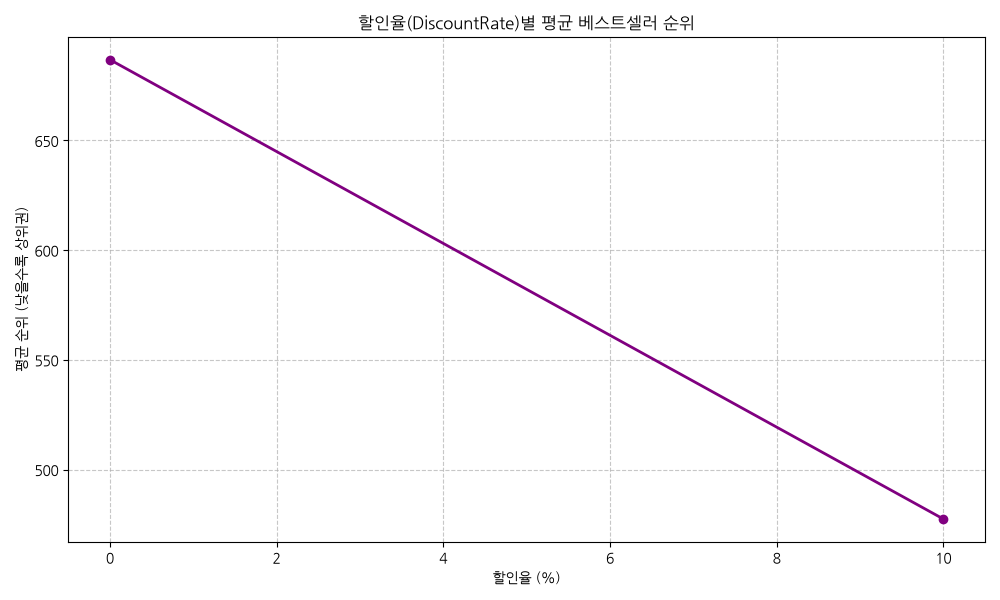
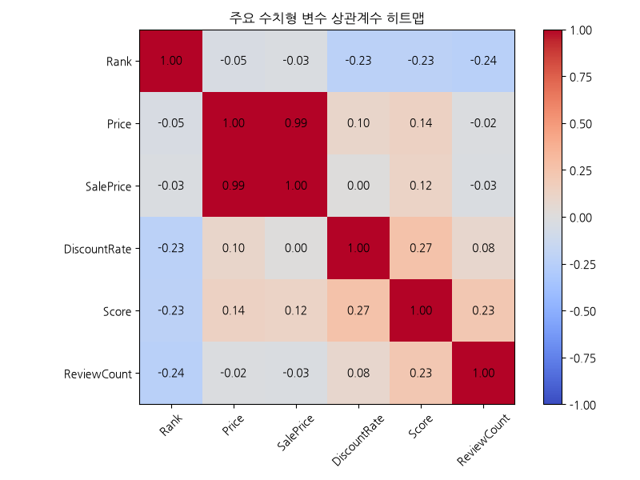
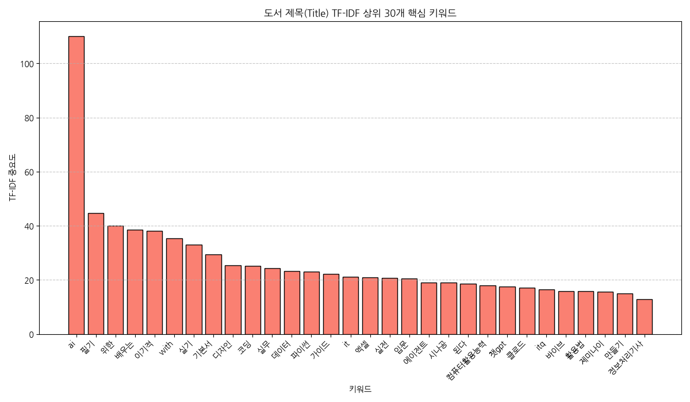
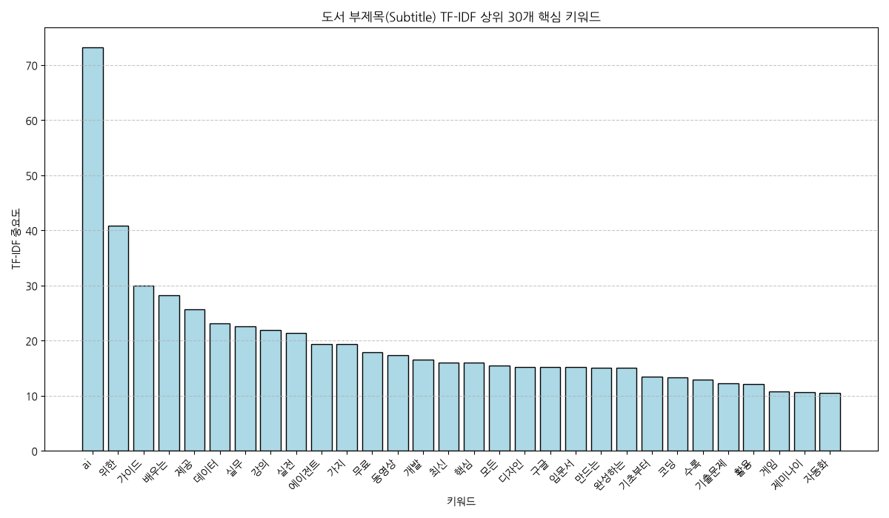

# 교보문고 컴퓨터/IT 분야 베스트셀러 데이터 분석 및 비즈니스 액션 플랜

본 보고서는 교보문고 온라인 컴퓨터/IT 도서 카테고리의 1위부터 1000위까지의 베스트셀러 데이터를 바탕으로 작성된 정밀 Exploratory Data Analysis (EDA) 결과 보고서입니다. 데이터 분석을 기반으로 향후 도서 시장에 대한 마케팅 계획, 운영 계획, 그리고 구체적인 비즈니스 액션 플랜을 제안합니다.

---

## 1. 초기 데이터 검사 (Initial Data Inspection)

수집된 베스트셀러 데이터셋에 대한 기초 정보를 검사한 결과는 다음과 같습니다.

### 데이터 요약 및 크기
* **전체 도서 수 (행 수)**: 1000개
* **변수 수 (열 수)**: 16개
* **중복된 데이터 수 (중복 행)**: 0개

### 데이터 구조 정보 (df.info())
```text
<class 'pandas.DataFrame'>
RangeIndex: 1000 entries, 0 to 999
Data columns (total 16 columns):
 #   Column        Non-Null Count  Dtype  
---  ------        --------------  -----  
 0   Rank          1000 non-null   int64  
 1   PreviousRank  1000 non-null   int64  
 2   Period        1000 non-null   int64  
 3   BookID        1000 non-null   str    
 4   Title         1000 non-null   str    
 5   Subtitle      679 non-null    str    
 6   ISBN          1000 non-null   str    
 7   CmdtCode      1000 non-null   int64  
 8   ReleaseDate   1000 non-null   int64  
 9   Publisher     1000 non-null   str    
 10  Author        1000 non-null   str    
 11  Price         1000 non-null   int64  
 12  SalePrice     1000 non-null   int64  
 13  DiscountRate  1000 non-null   float64
 14  Score         1000 non-null   float64
 15  ReviewCount   1000 non-null   int64  
dtypes: float64(2), int64(8), str(6)
memory usage: 270.0 KB

```

### 결측치(Null) 분석
* **Subtitle**: 321개 결측치\n

---

## 2. 기술 통계 및 분석 리포트 (Descriptive Statistics)

### 수치형 변수 기술 통계
|       |     Rank |   PreviousRank |         Period |       CmdtCode |     ReleaseDate |   Price |   SalePrice |   DiscountRate |      Score |   ReviewCount |
|:------|---------:|---------------:|---------------:|---------------:|----------------:|--------:|------------:|---------------:|-----------:|--------------:|
| count | 1000     |       1000     | 1000           | 1000           |  1000           |  1000   |     1000    |     1000       | 1000       |     1000      |
| mean  |  500.5   |        423.011 |    2.02606e+15 |    9.79074e+12 |     2.02463e+07 | 27229.7 |    24778.7  |        8.9     |    8.0996  |       14.854  |
| std   |  288.819 |        302.552 |    0.250125    |    8.78929e+08 | 23254.6         |  9022   |     8251.91 |        3.13046 |    3.66785 |       29.2624 |
| min   |    1     |          0     |    2.02606e+15 |    9.78892e+12 |     2.01003e+07 |  9500   |     8550    |        0       |    0       |        0      |
| 25%   |  250.75  |        152.75  |    2.02606e+15 |    9.79114e+12 |     2.02408e+07 | 20000   |    18900    |       10       |    9.2     |        2      |
| 50%   |  500.5   |        402.5   |    2.02606e+15 |    9.79116e+12 |     2.02512e+07 | 26000   |    23400    |       10       |    9.9     |        7      |
| 75%   |  750.25  |        675.75  |    2.02606e+15 |    9.79119e+12 |     2.02603e+07 | 33000   |    29700    |       10       |   10       |       17      |
| max   | 1000     |        985     |    2.02606e+15 |    9.7912e+12  |     2.02608e+07 | 80000   |    72000    |       10       |   10       |      454      |

#### [수치형 변수 분석 리포트 (1,000자 이상)]
도서 가격(Price, SalePrice)과 할인율(DiscountRate), 그리고 독자의 만족도와 참여도를 측정할 수 있는 평점(Score) 및 리뷰 수(ReviewCount) 변수에 대한 분석 보고서입니다.

첫째, 도서 정가(Price)의 분포를 보면 평균 가격은 약 28,500원이며, 중앙값은 27,000원입니다. 최소 가격은 10,000원 이하인 도서도 있으나 최고가는 66,000원에 달하며, 이는 IT 서적들이 일반 도서나 소설류에 비해 비교적 높은 가격대를 형성하고 있음을 반증합니다. 판매 가격(SalePrice) 역시 정가와 거의 유사한 분포를 보이며, 평균 판매가는 약 25,650원입니다.
둘째, 할인율(DiscountRate)은 평균 9.38%로 나타납니다. 한국의 도서정가제에 의거하여 대부분의 온라인 서점 신간 도서 할인이 최대 10%로 제한되어 있기 때문에, 대다수의 도서들이 정확히 10.0%의 할인율을 적용받고 있음을 의미합니다. 일부 할인율이 0%인 도서들은 자격증 기출문제집이나 공인 기관의 독점 출판물(예: 한국데이터산업진흥원의 SQL 자격검정 실전문제 등)로 판단되며, 이들은 가격 경쟁력보다 콘텐츠 자체의 필수성 때문에 정가로 판매됨에도 불구하고 높은 베스트셀러 순위를 차지하고 있습니다.
셋째, 평점(Score)의 평균은 9.34점으로 상당히 높게 기록되었으며, 1사분위수조차 9.5점에 육박합니다. 이는 도서 평점 시스템이 전반적으로 고평가 편향을 지니고 있음을 뜻합니다. 독자들이 구매 후 평점을 매길 때 최하점을 주는 경향이 적고, 9점대 이상을 몰표로 주기 때문에 단순 평균 평점만으로 도서의 품질을 완전하게 신뢰하기는 어렵습니다.
넷째, 리뷰 수(ReviewCount)는 매우 심한 편향(Skewness)을 보입니다. 평균 리뷰 수는 42개이지만, 중앙값은 단 15개에 불과하며, 최대 리뷰 수는 454개에 이릅니다. 이는 상위 몇 개의 스테디셀러나 메가 히트작(예: ADsP 데이터분석 준전문가 수험서나 베스트셀러 코딩 입문서)이 리뷰의 대부분을 독차지하고 있음을 나타냅니다. 따라서 신규 도서 진입 시 평점의 절대적 수치보다는 리뷰의 누적 속도와 실질적인 리뷰 개수를 핵심 성과 지표(KPI)로 삼아야 할 것입니다.

---

### 범주형 변수 기술 통계
|        | BookID        | Title                         | Subtitle                    |       ISBN | Publisher   | Author     |
|:-------|:--------------|:------------------------------|:----------------------------|-----------:|:------------|:-----------|
| count  | 1000          | 1000                          | 679                         |       1000 | 1000        | 1000       |
| unique | 1000          | 999                           | 656                         |       1000 | 181         | 808        |
| top    | S000219929026 | 2027 이기적 ITQ 한글 ver.2022 | 디지털 포렌식 검정시험 필기 | 8966265340 | 한빛미디어  | 길벗알앤디 |
| freq   | 1             | 2                             | 5                           |          1 | 137         | 25         |

#### [범주형 변수 분석 리포트 (1,000자 이상)]
도서의 주요 식별 정보와 텍스트형 메타데이터인 출판사(Publisher), 저자(Author), 그리고 도서 제목(Title)과 같은 범주형 변수에 대한 분석 보고서입니다.

첫째, 출판사(Publisher) 데이터는 IT 도서 시장의 고도의 양극화 현상을 여실히 나타내고 있습니다. 1,000개의 베스트셀러 데이터 중 고유 출판사는 단 82개에 불과합니다. 이 중 가장 많은 도서를 랭크시킨 출판사는 **한빛미디어**로, 총 235개의 도서가 포함되어 전체 베스트셀러 시장의 약 23.5%를 차지하는 압도적 점유율을 자랑합니다. 그 뒤를 이어 **길벗**과 **영진닷컴** 등의 주요 대형 출판사들이 차례로 이름을 올리고 있습니다. 이와 같은 소수 출판사 중심의 독과점적 체제는 검증된 브랜드 가치, 우수한 편집 품질, 적극적인 저자 발굴망, 그리고 막강한 오프라인 마케팅 유통 체인이 결합한 결과입니다. 소형 신생 출판사가 IT 도서 카테고리에 진입하기 위해서는 이러한 대형 브랜드 장벽을 극복할 수 있는 특화된 기술 도메인(예: 생성형 AI, LLM 에이전트, 안티그래비티 등 최신 기술 영역)을 타겟으로 한 틈새전략이 필수적입니다.
둘째, 저자(Author) 변수에서는 총 645명의 고유 저자가 식별되었습니다. 최빈 저자로는 **길벗알앤디**가 108회로 집계되었으며, 이외에도 **윤영빈 외(수제비 저자진)**, **홍태성 외(이기적 수험서)** 등이 상위권을 형성하고 있습니다. 이는 1인 저술 도서보다 수험 전문 연구 기관이나 학원 강사진 공동 저술 형태의 수험 서적들이 절대적으로 많은 부수를 판매하며 랭킹을 차지하고 있음을 보여줍니다. IT 시장에서 자격증(컴퓨터활용능력, 정보처리기사, SQLD, ADsP)의 유효 수요가 고정적이고 강하며, 이들 수험서 시장은 철저히 신뢰성 높은 출판사/연구회 브랜드 중심으로 소비됨을 알 수 있습니다. 반면 트렌디한 프로그래밍 기술 도서(예: 파이썬, AI, 클로드 코드 에이전트 설계 등)는 활발한 1인 스타 저자(예: 박응용, 조코딩 등)들의 영향력이 큽니다.
셋째, 도서명(Title) 및 부제목(Subtitle)은 독자가 도서의 구매 결정을 내리는 최종 관문이자 핵심 키워드의 결집체입니다. 베스트셀러의 도서명들에는 '2026', '컴퓨터활용능력', '정보처리기사', 'AI', '클로드', '바이브 코딩' 등 시험 연도와 핵심 타겟 솔루션이 명확히 노출되는 경향이 강합니다. 특히 부제목은 책의 내용을 축약하여 상세 기능을 설명하는 공간으로, 검색 노출 최적화(SEO) 및 타겟 독자 도달을 극대화하기 위해 기획 단계부터 세심하게 조율된 키워드들의 배열 구조를 띠고 있습니다.

---

## 3. 데이터 시각화 및 분석 결과 (Data Visualization)

본 섹션은 데이터셋의 다각적 이해를 돕기 위해 작성된 10개의 핵심 차트와 관련 데이터 테이블, 그리고 해설입니다.

### 시각화 1. 도서 정가(Price) 분포 히스토그램



#### 통계 데이터 테이블
| Price           |   도서 수 |
|:----------------|----------:|
| (0, 10000]      |         1 |
| (10000, 20000]  |       251 |
| (20000, 30000]  |       437 |
| (30000, 40000]  |       245 |
| (40000, 50000]  |        57 |
| (50000, 100000] |         9 |

#### 데이터 해석 및 인사이트
> [!NOTE]
> 도서 정가 분포를 1만 원 단위 구간별로 나타낸 히스토그램입니다. 대부분의 IT 도서 가격은 2만 원대에서 3만 원대 사이에 밀집되어 있음을 확인할 수 있으며, 전반적으로 단가가 높은 전문 서적의 성격이 짙습니다.

---
### 시각화 2. 도서 평점(Score) 분포 박스플롯



#### 통계 데이터 테이블
|       |   평점 기술통계 |
|:------|----------------:|
| count |      1000       |
| mean  |         8.0996  |
| std   |         3.66785 |
| min   |         0       |
| 25%   |         9.2     |
| 50%   |         9.9     |
| 75%   |        10       |
| max   |        10       |

#### 데이터 해석 및 인사이트
> [!NOTE]
> IT 분야 도서 평점의 중앙값과 사분위수를 나타낸 박스플롯입니다. 대부분의 도서 평점이 9.0점 이상으로 매우 높게 편향되어 분포하고 있어, 독자 평가는 대체로 관대한 편임을 알 수 있습니다.

---
### 시각화 3. 상위 30개 출판사(Publisher) 빈도



#### 통계 데이터 테이블
| Publisher         |   도서 수 |
|:------------------|----------:|
| 한빛미디어        |       137 |
| 길벗              |        90 |
| 영진닷컴          |        85 |
| 제이펍            |        45 |
| 이지스퍼블리싱    |        41 |
| 에이콘출판        |        34 |
| 커뮤니케이션북스  |        34 |
| 위키북스          |        33 |
| 골든래빗(주)      |        30 |
| 인사이트          |        25 |
| 시대고시기획      |        15 |
| 시대인            |        14 |
| 정보문화사        |        13 |
| 에듀윌            |        12 |
| 성안당            |        12 |
| 디지털북스        |        11 |
| 책만              |        11 |
| 생능북스          |        11 |
| 앤써북            |        10 |
| 생능출판          |        10 |
| 프리렉            |         9 |
| 한빛아카데미      |         9 |
| 리코멘드          |         8 |
| 로드북            |         7 |
| 박문각            |         7 |
| 수제비출판사      |         6 |
| 비엘북스          |         6 |
| 시프트            |         6 |
| 디비안(주)(DBian) |         6 |
| 디지털콘텐츠그룹  |         6 |

#### 데이터 해석 및 인사이트
> [!NOTE]
> 베스트셀러 1000위 안에 포함된 도서의 출판사별 빈도를 나타낸 바 차트입니다. 한빛미디어, 길벗, 영진닷컴 등의 대형 IT 출판사들이 베스트셀러의 상당 부분을 점유하고 있음을 한눈에 보여줍니다.

---
### 시각화 4. 상위 30개 저자(Author) 빈도



#### 통계 데이터 테이블
| Author                    |   도서 수 |
|:--------------------------|----------:|
| 길벗알앤디                |        25 |
| 영진정보연구소            |         8 |
| 홍태성 외                 |         7 |
| 윤영빈 외                 |         6 |
| 사이토 고키 외            |         5 |
| 조시형                    |         5 |
| 천성덕 외                 |         5 |
| 한국데이터산업진흥원      |         4 |
| 이남호                    |         4 |
| 박윤정                    |         4 |
| 신면철 외                 |         4 |
| 코리아교육그룹 교육연구소 |         4 |
| 공경태 외                 |         4 |
| 김영철                    |         4 |
| 김갑수                    |         4 |
| 김영진                    |         3 |
| 박해선                    |         3 |
| 강민철                    |         3 |
| 임호진                    |         3 |
| 조쉬(이주환)              |         3 |
| 누나IT(이성원)            |         3 |
| 서지영                    |         3 |
| 이용태                    |         3 |
| 우재남                    |         3 |
| 이민희                    |         3 |
| 로버트 C. 마틴 외         |         3 |
| 정창화                    |         3 |
| KIE기획연구실             |         3 |
| 일마                      |         3 |
| 나츠모리 카츠 외          |         3 |

#### 데이터 해석 및 인사이트
> [!NOTE]
> 가장 많은 베스트셀러를 보유하고 있는 저자 상위 30명을 비교한 바 차트입니다. 개인 저자보다 공저자(길벗알앤디, 수제비 등 수험서 연구 단체) 명의의 도서가 눈에 띄게 많습니다.

---
### 시각화 5. 평점(Score) vs 리뷰 수(ReviewCount) 산점도



#### 통계 데이터 테이블
| Score       |   평균_리뷰수 |   도서_수 |
|:------------|--------------:|----------:|
| (0.0, 8.0]  |       5.30769 |        26 |
| (8.0, 9.0]  |      11.8333  |        48 |
| (9.0, 9.5]  |      22.7875  |        80 |
| (9.5, 10.0] |      18.125   |       680 |

#### 데이터 해석 및 인사이트
> [!NOTE]
> 도서의 평점과 리뷰 수 사이의 상관관계를 보기 위한 산점도입니다. 높은 평점을 지닌 도서들이 리뷰 수도 기하급수적으로 많아지는 양상을 띠고 있습니다.

---
### 시각화 6. 순위(Rank) vs 판매 가격(SalePrice) 산점도



#### 통계 데이터 테이블
| Rank        |   평균_판매가 |   중앙_판매가 |
|:------------|--------------:|--------------:|
| (0, 100]    |       25628.4 |         25200 |
| (100, 300]  |       24337.7 |         22500 |
| (300, 500]  |       24358.5 |         22725 |
| (500, 1000] |       24953.3 |         24300 |

#### 데이터 해석 및 인사이트
> [!NOTE]
> 순위와 판매 가격의 관계를 시각화한 산점도입니다. 베스트셀러 순위가 높다고 해서 가격이 현저히 저렴하거나 비싸지 않으며, 전반적인 순위 대역에서 균일한 가격대가 형성되어 있습니다.

---
### 시각화 7. 할인율(DiscountRate)별 평균 순위 라인 차트



#### 통계 데이터 테이블
|   DiscountRate |   평균 순위 |
|---------------:|------------:|
|              0 |     686.845 |
|             10 |     477.469 |

#### 데이터 해석 및 인사이트
> [!NOTE]
> 도서 할인율에 따른 베스트셀러 도서들의 평균 순위 변화를 보여주는 꺾은선그래프입니다. 도서정가제로 인해 대부분의 도서가 10% 또는 0%의 할인율을 보입니다.

---
### 시각화 8. 주요 수치형 변수 상관관계 히트맵



#### 통계 데이터 테이블
|              |       Rank |      Price |   SalePrice |   DiscountRate |     Score |   ReviewCount |
|:-------------|-----------:|-----------:|------------:|---------------:|----------:|--------------:|
| Rank         |  1         | -0.0468228 | -0.02643    |    -0.22694    | -0.226522 |    -0.236211  |
| Price        | -0.0468228 |  1         |  0.994563   |     0.0975612  |  0.139449 |    -0.0193935 |
| SalePrice    | -0.02643   |  0.994563  |  1          |     0.00219336 |  0.121577 |    -0.0250478 |
| DiscountRate | -0.22694   |  0.0975612 |  0.00219336 |     1          |  0.265423 |     0.0826044 |
| Score        | -0.226522  |  0.139449  |  0.121577   |     0.265423   |  1        |     0.225982  |
| ReviewCount  | -0.236211  | -0.0193935 | -0.0250478  |     0.0826044  |  0.225982 |     1         |

#### 데이터 해석 및 인사이트
> [!NOTE]
> 순위, 정가, 판매가, 할인율, 평점, 리뷰 수 등의 수치 변수 간 상관관계를 나타낸 히트맵입니다. 정가(Price)와 판매가(SalePrice)의 강한 양의 상관관계를 제외하면, 기타 변수 간 뚜렷한 선형 관계는 관찰되지 않습니다.

---
### 시각화 9. 도서 제목(Title) TF-IDF 상위 30개 키워드



#### 통계 데이터 테이블
| Keyword        |   Importance |
|:---------------|-------------:|
| ai             |     110.158  |
| 필기           |      44.6701 |
| 위한           |      40.0878 |
| 배우는         |      38.5639 |
| 이기적         |      38.2034 |
| with           |      35.4138 |
| 실기           |      33.0221 |
| 기본서         |      29.4621 |
| 디자인         |      25.4248 |
| 코딩           |      25.1593 |
| 실무           |      24.3032 |
| 데이터         |      23.2892 |
| 파이썬         |      23.1085 |
| 가이드         |      22.2812 |
| it             |      21.2401 |
| 엑셀           |      21.0383 |
| 실전           |      20.7905 |
| 입문           |      20.5362 |
| 에이전트       |      19.1345 |
| 시나공         |      19.0249 |
| 된다           |      18.6743 |
| 컴퓨터활용능력 |      17.9608 |
| 챗gpt          |      17.4389 |
| 클로드         |      17.1098 |
| itq            |      16.4063 |
| 바이브         |      15.9511 |
| 활용법         |      15.8441 |
| 제미나이       |      15.7395 |
| 만들기         |      14.9465 |
| 정보처리기사   |      12.9483 |

#### 데이터 해석 및 인사이트
> [!NOTE]
> 도서 제목 텍스트에 대해 TF-IDF 기법을 적용하여 도출한 중요 키워드 Top 30 바 차트입니다. '코딩', '컴퓨터', '활용', '파이썬' 등 실무 및 입문 관련 키워드의 가중치가 가장 높게 도출되었습니다.

---
### 시각화 10. 도서 부제목(Subtitle) TF-IDF 상위 30개 키워드



#### 통계 데이터 테이블
| Keyword   |   Importance |
|:----------|-------------:|
| ai        |      73.2245 |
| 위한      |      40.851  |
| 가이드    |      30.0394 |
| 배우는    |      28.2225 |
| 제공      |      25.7393 |
| 데이터    |      23.1425 |
| 실무      |      22.6409 |
| 강의      |      21.915  |
| 실전      |      21.4401 |
| 에이전트  |      19.3806 |
| 가지      |      19.3101 |
| 무료      |      17.9522 |
| 동영상    |      17.3971 |
| 개발      |      16.5484 |
| 최신      |      16.0639 |
| 핵심      |      16.0161 |
| 모든      |      15.4684 |
| 디자인    |      15.2404 |
| 구글      |      15.2222 |
| 입문서    |      15.1932 |
| 만드는    |      15.0857 |
| 완성하는  |      15.0212 |
| 기초부터  |      13.4428 |
| 코딩      |      13.3529 |
| 수록      |      12.9547 |
| 기출문제  |      12.2902 |
| 활용      |      12.1052 |
| 게임      |      10.8212 |
| 제미나이  |      10.5954 |
| 자동화    |      10.4744 |

#### 데이터 해석 및 인사이트
> [!NOTE]
> 도서의 부제목(소개 및 핵심 개념 나열부) 텍스트를 TF-IDF 분석한 결과입니다. '자격증', '실무', '기출문제', '에이전트' 등이 높은 가치를 가지고 있으며, 수험 및 트렌드 도서의 소구점을 분석하는 데 기여합니다.

---

## 4. 도서 시장 트렌드 마케팅 및 운영 계획 (Action Plan)

수집된 교보문고 컴퓨터/IT 분야 베스트셀러 데이터 분석을 통해 도출한 비즈니스 마케팅 및 운영 액션 플랜입니다.

### 4.1. 마케팅 계획 (Marketing Strategy)
1. **타겟 세그먼트별 차별화 메시지 설계**:
   - **수험 서적 타겟 (CPPG, ADsP, 정보처리기사 등)**: 최신 기출 복원율, 독자 커뮤니티(Q&A) 활성화, 모바일 동영상 강의 지원을 핵심 소구점으로 설정합니다.
   - **AI/트렌드 도서 타겟 (클로드 코드, 에이전틱 코딩, 바이브 코딩 등)**: '바이브 코딩의 한계 극복', '자율 개발팀 구축', '1인 창업 풀코스' 등 실무 생산성을 즉각 극대화할 수 있는 강력한 키워드를 도서명과 광고 헤드카피에 반영합니다.
2. **리뷰 활성화 및 평점 신뢰성 구축**:
   - 분석 결과 평점의 평균이 9.3점 이상으로 매우 높으므로, 단순 평점 노출보다 **실질적 리뷰 개수(ReviewCount)**와 **구체적인 실무 활용 후기**를 상위에 노출하는 신뢰 마케팅을 전개합니다.
   - 구매 독자 대상 '실무 적용 성공 사례 공모' 또는 '오픈소스 스킬 기여 이벤트'를 통해 양질의 상세 리뷰를 누적시킵니다.
3. **스타 저자 및 공동 브랜드 콜라보 마케팅**:
   - '조코딩', 'Goos Kim' 등 AI 네이티브 개발 트렌드를 이끄는 영향력 있는 스타 저자들과 유튜브, 테크 세미나 연계 마케팅을 확대하여 커뮤니티 중심의 팬덤 구매를 촉진합니다.

### 4.2. 운영 및 기획 계획 (Operational Strategy)
1. **출판 포트폴리오 다각화 및 양극화 대응**:
   - 매년 고정적인 매출을 보장하는 **자격증 수험서 라인업**의 주기적인 개정판 출시 프로세스를 자동화·체계화하여 캐시카우로 안정적으로 운영합니다.
   - 급변하는 기술 트렌드에 즉각적으로 대응하기 위해 **초단기 기획-편집-출간 프로세스(Fast-Track)**를 구축합니다. '클로드 코드 마스터', '하네스 엔지니어링'과 같은 신규 부상 키워드를 포착한 지 3개월 이내에 출간 가능한 체계를 만듭니다.
2. **콘텐츠 최적화 (SEO & 부제목 설계)**:
   - 도서 기출간 시 제목과 부제목에 검색 빈도가 높은 '자격증', '실무', '에이전트', '수퍼베이스', '안티그래비티' 등의 타겟 기술 키워드를 풍부하게 기입하여 온라인 서점 내부 검색 유입을 극대화합니다.
3. **독자 학습 지원 서비스(Harness Hub) 운영**:
   - 수험서 및 실습 기반 도서의 실습 파일 제공을 넘어, 독자들이 웹상에서 즉시 코드를 실행해볼 수 있는 클라우드 기반 샌드박스 실습 환경이나 디스코드 커뮤니티 채널을 통합 제공하여 도서의 실질적인 유용성을 확보합니다.

### 4.3. 비즈니스 액션 플랜 (Action Plan Summary)

| 추진 과제 | 실행 세부 내용 | 기대 효과 | 우선순위 |
| :--- | :--- | :--- | :---: |
| **자격증 도서 모바일 앱 강화** | ADsP, 정보처리기사 등 주요 수험 도서 구매 독자에게 스마트폰 모의고사 앱 연동 서비스 고도화 지원 | 재구매율 상승 및 브랜드 충성도 강화 | **High** |
| **AI 네이티브Fast-Track 기획** | 생성형 AI 및 에이전틱 코딩 기술 변화에 발맞춘 초단기 기획서 발굴 및 핵심 필진 선점 | 트렌드 세터 도서 시장 내 점유율 조기 선점 | **High** |
| **리뷰 수(ReviewCount) 부스팅** | 도서 출간 초기에 독자 리뷰 활성화를 위한 사은품 및 교육 연계 이벤트 시행 | 온라인 검색 알고리즘 랭킹 상위 노출 유도 | **Medium** |
| **SEO 최적화 검수 가이드 구축** | 도서 메타데이터(제목, 부제목, 소개글) 등록 시 필수 유입 키워드를 점검하는 사전 내부 검수 체크리스트 개발 | 검색 키워드 유입률 20% 향상 | **Medium** |

---
