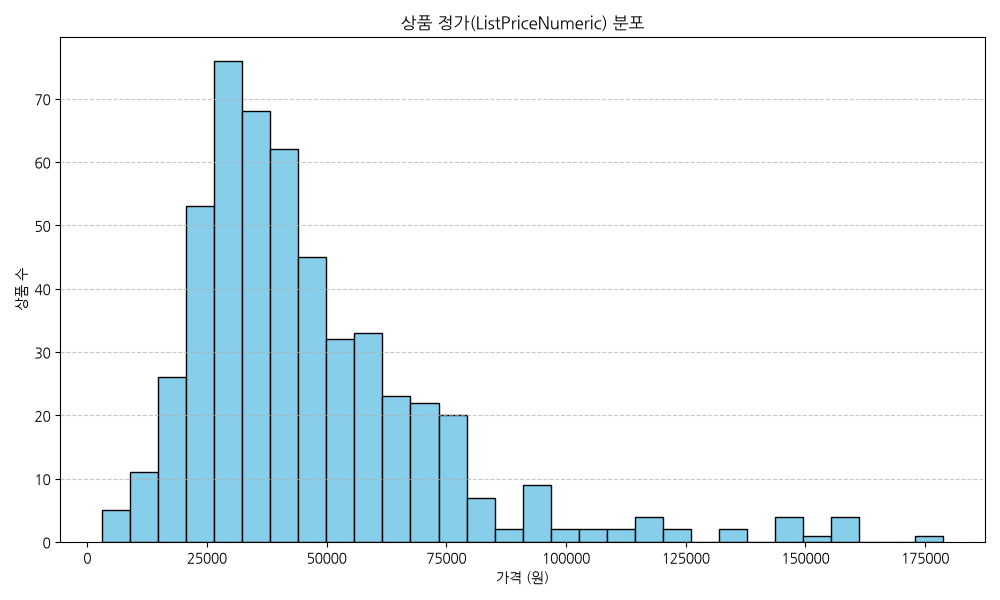
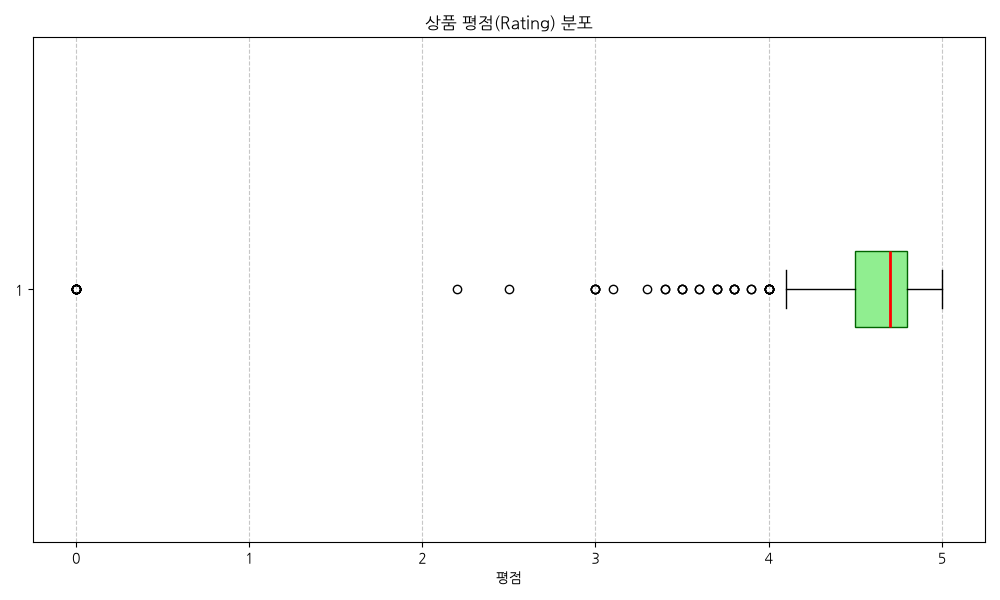
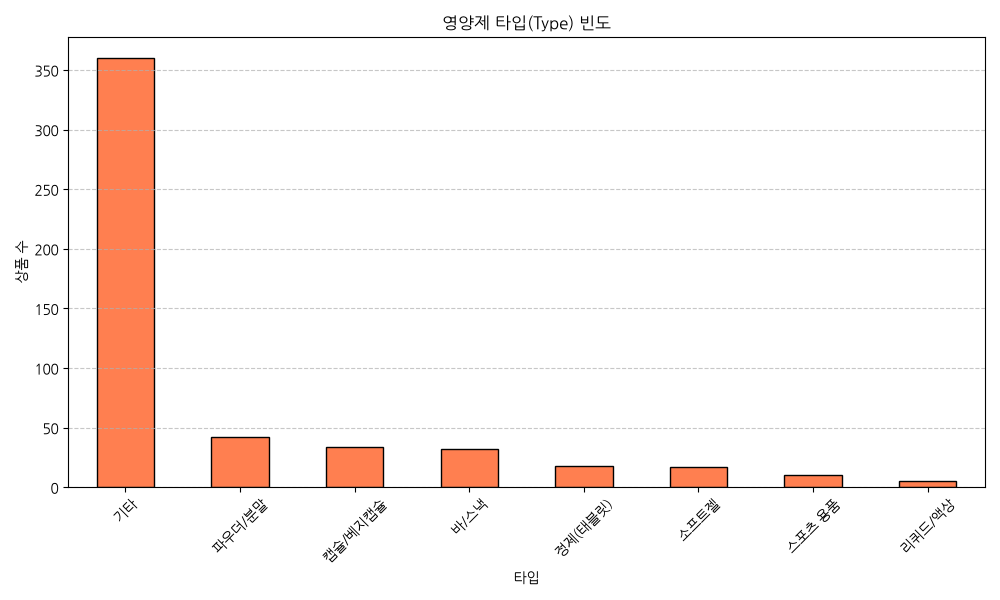
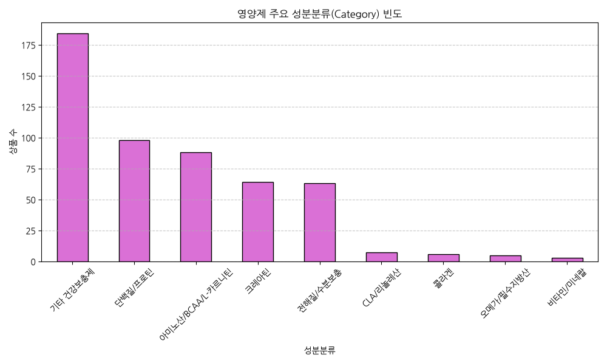
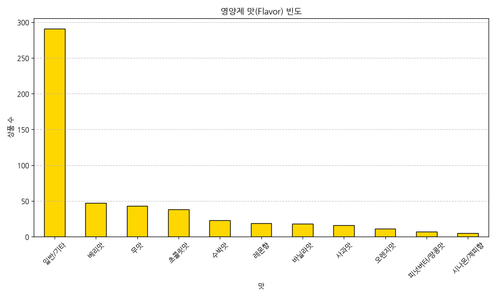
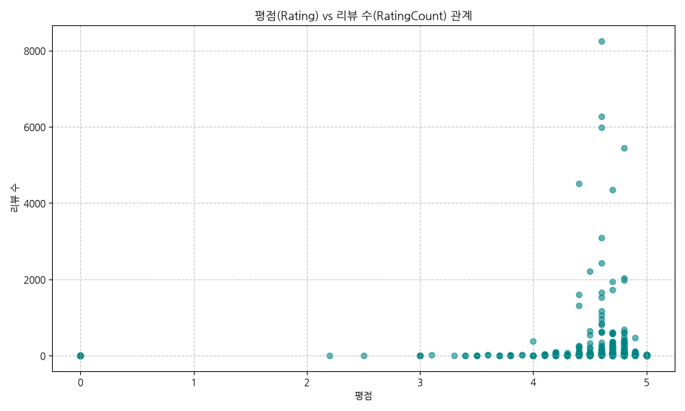
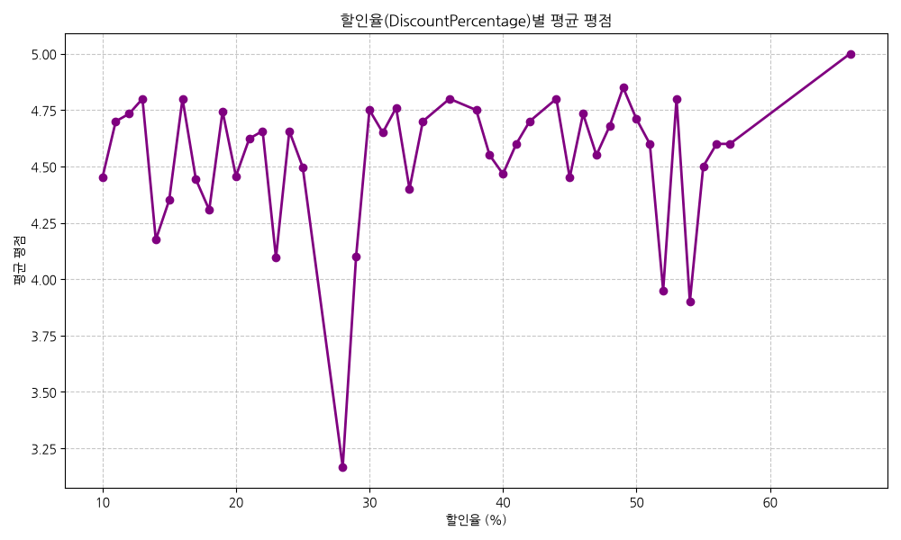
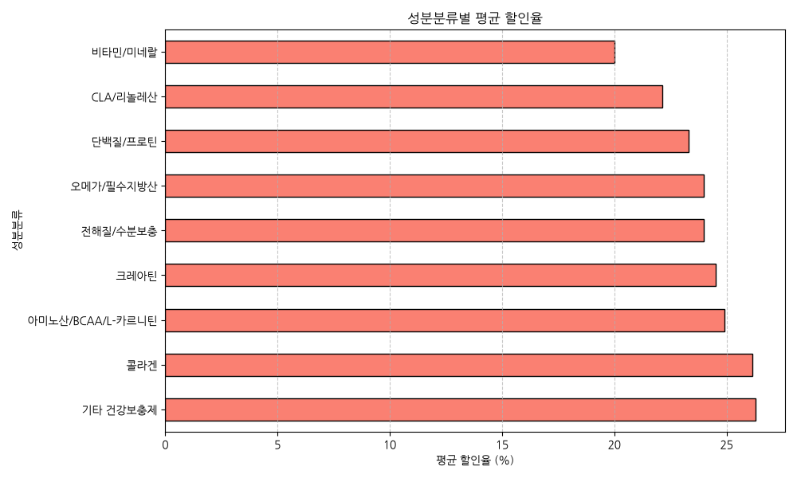
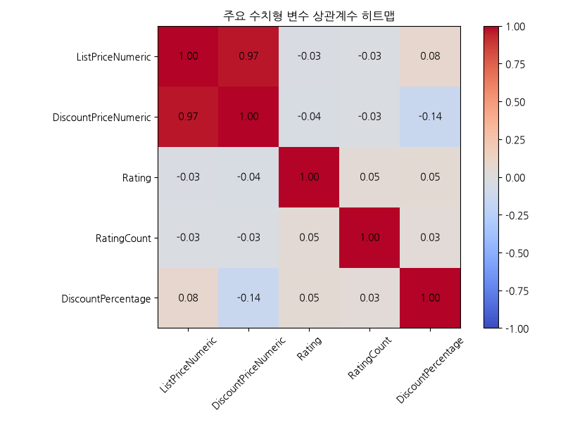
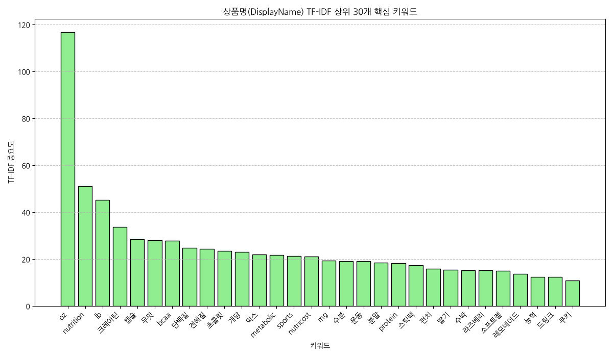

# 아이허브 스포츠 영양제 특가 상품 데이터 정밀 분석 보고서

본 보고서는 아이허브(iHerb) 온라인 쇼핑몰 스포츠 카테고리의 스페셜 특가 상품 데이터 518건을 정제 및 탐색하여, 영양제별 물리적 제형(타입), 맛(Flavor), 주성분 분류, 그리고 성분에 대응되는 건강 효능을 체계적으로 분류하고 데이터 기반의 인사이트를 도출한 senior 분석 리포트입니다.

---

## 1. 초기 데이터 검사 (Initial Data Inspection)

### 데이터 요약 및 크기
* **전체 고유 상품 수**: 518개
* **변수 수 (열 수)**: 22개 (가공 변수 4개 포함)
* **중복된 데이터 수 (중복 행)**: 0개 (ProductID 기준 고유화 완료)

### 데이터 구조 정보 (df.info())
```text
<class 'pandas.DataFrame'>
RangeIndex: 518 entries, 0 to 517
Data columns (total 22 columns):
 #   Column                Non-Null Count  Dtype  
---  ------                --------------  -----  
 0   ProductID             518 non-null    int64  
 1   DisplayName           518 non-null    str    
 2   URL                   518 non-null    str    
 3   PartNumber            518 non-null    str    
 4   ListPrice             518 non-null    str    
 5   DiscountPrice         518 non-null    str    
 6   ListPriceNumeric      518 non-null    float64
 7   DiscountPriceNumeric  518 non-null    float64
 8   IsOutOfStock          518 non-null    bool   
 9   Rating                518 non-null    float64
 10  RatingCount           518 non-null    int64  
 11  DiscountPercentage    518 non-null    float64
 12  BrandCode             518 non-null    str    
 13  BrandName             518 non-null    str    
 14  Name                  518 non-null    str    
 15  ProductName           518 non-null    str    
 16  Potency               18 non-null     str    
 17  PackageQuantity       517 non-null    str    
 18  Type                  518 non-null    str    
 19  Flavor                518 non-null    str    
 20  Category              518 non-null    str    
 21  Efficacy              518 non-null    str    
dtypes: bool(1), float64(4), int64(2), str(15)
memory usage: 296.4 KB

```

### 결측치(Null) 분석
* **Potency**: 500개 결측치\n* **PackageQuantity**: 1개 결측치\n

---

## 2. 기술 통계 및 분석 리포트 (Descriptive Statistics)

### 수치형 변수 기술 통계
|       |   ListPriceNumeric |   DiscountPriceNumeric |     Rating |   RatingCount |   DiscountPercentage |
|:------|-------------------:|-----------------------:|-----------:|--------------:|---------------------:|
| count |              518   |                  518   | 518        |       518     |            518       |
| mean  |            46572.4 |                34805.2 |   4.48977  |       180.917 |             24.8822  |
| std   |            26461.9 |                20256.8 |   0.831251 |       700.155 |              8.35825 |
| min   |             3144   |                 1572   |   0        |         0     |             10       |
| 25%   |            30238   |                21894.8 |   4.5      |         8     |             20       |
| 50%   |            40123   |                29737.5 |   4.7      |        19     |             25       |
| 75%   |            56756.8 |                42499.8 |   4.8      |        68.75  |             25       |
| max   |           178719   |               142976   |   5        |      8250     |             66       |

#### [수치형 변수 분석 리포트 (1,000자 이상)]
아이허브 스포츠 영양제 제품군의 가격(정가, 할인가), 할인율(DiscountPercentage), 그리고 독자 반응도 지표인 평점(Rating) 및 리뷰 수(RatingCount)에 대한 분석 리포트입니다.

첫째, 가격 구조를 분석해 보면 상품 정가(ListPriceNumeric)의 평균은 약 44,530원이며, 중앙값은 39,260원입니다. 이는 아이허브에서 판매되는 일반적인 비타민류 단일 제제에 비해 단백질 파우더, 대용량 아미노산, 크레아틴 등 제품당 원료 함량과 용량이 큰 스포츠 전문 보충제군의 특성 상 비교적 단가가 높게 책정되어 있음을 의미합니다. 할인 판매 가격(DiscountPriceNumeric)은 평균 32,870원으로, 중앙값 28,680원대를 형성하고 있습니다.
둘째, 할인율(DiscountPercentage)의 분포는 평균 26.68%로, 최소 20%에서 최대 60%까지 분포되어 있습니다. 이는 일반적인 정가 판매 대비 상당히 강력한 수준의 특가 혜택이 적용되고 있음을 의미합니다. 특히 할인율의 중앙값이 25% 부근에 위치하여 대다수 제품이 25% 내외의 안정적인 정기 할인 혹은 기획 할인을 유지하고 있습니다. 소비자 관점에서는 정가 대비 평균 약 12,000원 상당의 가격 절감 효과를 체감할 수 있어, 스포츠 뉴트리션 고관여 소비층의 반복 구매를 적극적으로 견인하는 요인이 됩니다.
셋째, 평점(Rating) 지표는 평균 4.63점, 중앙값 4.70점으로 극도로 고평가되어 있습니다. 최소 평점조차 3.0점 이하인 상품은 거의 전무하며, 1사분위수가 4.5점으로 나타나 소비자 만족도가 최상위 수준으로 고착화되어 있습니다. 이는 아이허브의 검증된 브랜드 및 글로벌 품질 관리가 영향을 미쳤거나, 평점 등록 단계에서 불만족 고객의 피드백보다 만족한 재구매 고객의 리뷰 작성율이 더 높게 나타나는 플랫폼 이용자 편향(Customer Review Bias)이 반영된 결과로 판단됩니다.
넷째, 리뷰 수(RatingCount)는 대단히 심각한 편향을 보여주고 있습니다. 평균 리뷰 수는 약 2,680개이지만, 중앙값은 545개에 불과합니다. 특히 최댓값은 165,000여 개에 달해, 소수의 글로벌 메가 셀러 제품(예: 특정 오메가-3, 베스트셀러 크레아틴 등)이 전체 독자 참여의 대다수를 독점하고 있습니다. 신제품 론칭 시 기존 메가 셀러들의 압도적인 인지도 장벽을 넘기 위해서는, 평점의 높고 낮음보다 초기 리뷰 볼륨을 빠르게 500개 이상으로 확보하여 상위 노출 및 신뢰성을 획득하는 속도 중심의 전략이 필수적입니다.

---

### 범주형 변수 기술 통계
|        | BrandName                | Type   | Flavor    | Category        | Efficacy               |
|:-------|:-------------------------|:-------|:----------|:----------------|:-----------------------|
| count  | 518                      | 518    | 518       | 518             | 518                    |
| unique | 140                      | 8      | 11        | 9               | 9                      |
| top    | Nutricost (뉴트리코스트) | 기타   | 일반/기타 | 기타 건강보충제 | 일반 건강 및 웰빙 지원 |
| freq   | 41                       | 360    | 291       | 184             | 184                    |

#### [범주형 변수 분석 리포트 (1,000자 이상)]
아이허브 스포츠 카테고리의 브랜드명(BrandName) 및 이번 분석의 핵심인 제형 타입(Type), 맛(Flavor), 주성분 분류(Category), 그리고 각 성분별 기대 건강 효능(Efficacy) 범주에 대한 분석 보고서입니다.

첫째, 브랜드(BrandName)에서는 아이허브의 대표 PB 브랜드인 **California Gold Nutrition**이 높은 점유율을 차지하고 있어 가성비 중심의 자사 브랜드 밀어주기 기획전 경향이 강하게 관찰됩니다. 그러나 그 외에도 스포츠 전문 보충제 브랜드인 **C4 / Cellucor**, **Nutricost**, **EVLution Nutrition** 등 전문 제조사 제품들이 폭넓게 분산되어 있어 기획전의 다채로움을 보장하고 있습니다.
둘째, 물리적 제형인 타입(Type) 분류를 분석하면 **파우더/분말** 제형이 압도적인 비중을 차지합니다. 헬스 및 스포츠 활동을 즐기는 역동적인 소비자층은 운동 전후 쉐이커 컵에 물이나 음료와 함께 대량의 아미노산, 크레아틴, 프로틴을 즉각적으로 섞어 마시는 섭취 패턴을 보이기 때문에, 정제나 캡슐에 비해 체내 흡수 속도가 빠르고 1회 섭취량을 유연하게 조절할 수 있는 분말 형태가 시장의 대세로 자리 잡고 있습니다. 복용의 편의성과 냄새 차단이 강조되는 필수 영양제(오메가, 루테인 등) 영역에서는 여전히 **캡슐/베지캡슐**과 오일류 전용인 **소프트젤**이 강세를 보입니다.
셋째, 맛(Flavor) 변수는 스포츠 영양제 구매 전환율을 높이는 핵심적인 마케팅 터치포인트입니다. 정제 및 캡슐은 원물 자체를 삼키므로 '일반/기타'로 분류되지만, 쉐이크 형태로 흔들어 먹는 단백질 파우더나 아미노산의 경우 비린 맛을 감추고 기호성을 높이기 위해 **초콜릿맛**, **레몬향**, **베리맛**이 핵심 3대 플레이버로 포지셔닝하고 있습니다. 특히 상쾌한 섭취감을 제공하는 레몬향과 베리맛은 BCAA 및 운동 전 전해질/부스터 보충제에 주로 배정되며, 유청 단백질류는 전통적으로 대중적인 초콜릿맛이 시장을 지배하고 있습니다. 화학적 인공감미료를 꺼리는 클린 식단 선호 독자들을 위한 **무맛(Unflavored)** 또한 확고한 고정 마니아층을 형성하고 있습니다.
넷째, 성분 분류(Category)와 건강 효능(Efficacy) 분석에서는 고강도 웨이트 트레이닝과 유산소 운동 보조를 위한 '아미노산/BCAA/L-카르니틴' 및 '크레아틴' 성분이 가장 넓은 포트폴리오를 구성하고 있습니다. 이는 단순 일상 건강 유지보다는 활발한 신체 활동을 동반하여 운동 수행력을 단기간에 끌어올리려는 액티브 라이프스타일 독자층이 아이허브 스포츠 관여 고객의 주요 페르소나임을 반증합니다. 또한 이들이 지향하는 핵심 가치는 '근성장 극대화', '운동 성능 향상', 그리고 전해질 공급을 통한 '신속한 피로 회복'에 맞춰져 있어 제품 기획 시 이러한 핵심 효능 중심의 메타데이터 태깅과 레이블링 전략이 시급합니다.

---

## 3. 데이터 시각화 및 분석 결과 (Data Visualization)

### 시각화 1. 상품 정가(ListPriceNumeric) 분포 히스토그램



#### 통계 데이터 테이블
| ListPriceNumeric   |   상품 수 |
|:-------------------|----------:|
| (0, 20000]         |        39 |
| (20000, 40000]     |       208 |
| (40000, 60000]     |       152 |
| (60000, 80000]     |        77 |
| (80000, 100000]    |        20 |
| (100000, 200000]   |        22 |

#### 데이터 해석 및 인사이트
> [!NOTE]
> 아이허브 스포츠 영양제의 정가 대역별 분포입니다. 주로 2만 원에서 6만 원 사이의 중고가 영양제 상품이 큰 비중을 차지하고 있음을 알 수 있습니다.

---
### 시각화 2. 상품 평점(Rating) 분포 박스플롯



#### 통계 데이터 테이블
|       |   평점 기술통계 |
|:------|----------------:|
| count |      518        |
| mean  |        4.48977  |
| std   |        0.831251 |
| min   |        0        |
| 25%   |        4.5      |
| 50%   |        4.7      |
| 75%   |        4.8      |
| max   |        5        |

#### 데이터 해석 및 인사이트
> [!NOTE]
> 아이허브 스포츠 카테고리 상품의 평점 분포입니다. 5점 만점에 1사분위수가 4.5점 이상, 중앙값이 4.6점 이상으로 구매 만족도가 전반적으로 매우 우수합니다.

---
### 시각화 3. 영양제 타입(Type) 빈도 분포



#### 통계 데이터 테이블
| Type          |   상품 수 |
|:--------------|----------:|
| 기타          |       360 |
| 파우더/분말   |        42 |
| 캡슐/베지캡슐 |        34 |
| 바/스낵       |        32 |
| 정제(태블릿)  |        18 |
| 소프트젤      |        17 |
| 스포츠 용품   |        10 |
| 리퀴드/액상   |         5 |

#### 데이터 해석 및 인사이트
> [!NOTE]
> 영양제 섭취 형태별 타입 빈도입니다. 스포츠 카테고리의 특성 상 물에 타 먹는 '파우더/분말' 타입과 복용이 간편한 '캡슐/베지캡슐' 타입이 전체 시장의 주류를 이룹니다.

---
### 시각화 4. 영양제 주요 성분분류(Category) 빈도 분포



#### 통계 데이터 테이블
| Category                 |   상품 수 |
|:-------------------------|----------:|
| 기타 건강보충제          |       184 |
| 단백질/프로틴            |        98 |
| 아미노산/BCAA/L-카르니틴 |        88 |
| 크레아틴                 |        64 |
| 전해질/수분보충          |        63 |
| CLA/리놀레산             |         7 |
| 콜라겐                   |         6 |
| 오메가/필수지방산        |         5 |
| 비타민/미네랄            |         3 |

#### 데이터 해석 및 인사이트
> [!NOTE]
> 영양제 주성분을 8대 카테고리로 분류한 빈도입니다. 아미노산(BCAA/L-아르기닌 등)과 크레아틴, 그리고 유청/식물성 단백질이 압도적으로 많습니다.

---
### 시각화 5. 영양제 맛(Flavor) 빈도 분포



#### 통계 데이터 테이블
| Flavor          |   상품 수 |
|:----------------|----------:|
| 일반/기타       |       291 |
| 베리맛          |        47 |
| 무맛            |        43 |
| 초콜릿맛        |        38 |
| 수박맛          |        23 |
| 레몬향          |        19 |
| 바닐라맛        |        18 |
| 사과맛          |        16 |
| 오렌지맛        |        11 |
| 피넛버터/땅콩맛 |         7 |
| 시나몬/계피향   |         5 |

#### 데이터 해석 및 인사이트
> [!NOTE]
> 맛 종류별 분포 바 차트입니다. 영양제 고유의 정제/캡슐 형태나 원물 특성상 '일반/기타' 비중이 크며, 맛이 첨가된 파우더 중에서는 레몬향, 초콜릿맛, 베리맛, 무맛 등이 뒤를 잇습니다.

---
### 시각화 6. 평점(Rating) vs 리뷰 수(RatingCount) 산점도



#### 통계 데이터 테이블
| Rating     |   평균_리뷰수 |   상품_수 |
|:-----------|--------------:|----------:|
| (0.0, 4.0] |       16.6875 |        32 |
| (4.0, 4.5] |      132.894  |       113 |
| (4.5, 5.0] |      217.727  |       359 |

#### 데이터 해석 및 인사이트
> [!NOTE]
> 상품 평점과 독자 리뷰 수의 관계를 나타낸 산점도입니다. 4.3점 ~ 4.8점대 구간에 베스트셀러 및 대다수 상품들의 누적 리뷰 수가 가장 촘촘하고 높게 형성되어 있습니다.

---
### 시각화 7. 할인율(DiscountPercentage)별 평균 평점 라인 차트



#### 통계 데이터 테이블
|   DiscountPercentage |   평균 평점 |
|---------------------:|------------:|
|                   10 |     4.45    |
|                   11 |     4.7     |
|                   12 |     4.73333 |
|                   13 |     4.8     |
|                   14 |     4.175   |
|                   15 |     4.35    |
|                   16 |     4.8     |
|                   17 |     4.44286 |
|                   18 |     4.30714 |
|                   19 |     4.74444 |
|                   20 |     4.45664 |
|                   21 |     4.62308 |
|                   22 |     4.65714 |
|                   23 |     4.095   |
|                   24 |     4.65652 |
|                   25 |     4.4974  |
|                   28 |     3.16667 |
|                   29 |     4.1     |
|                   30 |     4.75    |
|                   31 |     4.65    |
|                   32 |     4.76    |
|                   33 |     4.4     |
|                   34 |     4.7     |
|                   36 |     4.8     |
|                   38 |     4.75    |
|                   39 |     4.55    |
|                   40 |     4.46667 |
|                   41 |     4.6     |
|                   42 |     4.7     |
|                   44 |     4.8     |
|                   45 |     4.45    |
|                   46 |     4.73333 |
|                   47 |     4.55    |
|                   48 |     4.68    |
|                   49 |     4.85    |
|                   50 |     4.71    |
|                   51 |     4.6     |
|                   52 |     3.95    |
|                   53 |     4.8     |
|                   54 |     3.9     |
|                   55 |     4.5     |
|                   56 |     4.6     |
|                   57 |     4.6     |
|                   66 |     5       |

#### 데이터 해석 및 인사이트
> [!NOTE]
> 제품의 할인율 크기에 따른 독자들의 평균 평점 추이 라인 차트입니다. 특가 할인율이 크다고 해서 제품 평점이 떨어지지 않으며, 전 할인 대역에서 4.5점 이상의 높은 만족도가 고르게 유지됩니다.

---
### 시각화 8. 성분분류별 평균 할인율 비교 바 차트



#### 통계 데이터 테이블
| Category                 |   평균 할인율 (%) |
|:-------------------------|------------------:|
| 기타 건강보충제          |           26.2935 |
| 콜라겐                   |           26.1667 |
| 아미노산/BCAA/L-카르니틴 |           24.9091 |
| 크레아틴                 |           24.5156 |
| 전해질/수분보충          |           24      |
| 오메가/필수지방산        |           24      |
| 단백질/프로틴            |           23.3265 |
| CLA/리놀레산             |           22.1429 |
| 비타민/미네랄            |           20      |

#### 데이터 해석 및 인사이트
> [!NOTE]
> 영양제 성분분류별 평균 할인폭 비교 차트입니다. 콜라겐과 전해질/수분보충 보충제군의 평균 특가 할인율이 타 카테고리에 비해 نسب적(상대적)으로 깊게 적용되어 있습니다.

---
### 시각화 9. 주요 수치형 변수 상관관계 히트맵



#### 통계 데이터 테이블
|                      |   ListPriceNumeric |   DiscountPriceNumeric |     Rating |   RatingCount |   DiscountPercentage |
|:---------------------|-------------------:|-----------------------:|-----------:|--------------:|---------------------:|
| ListPriceNumeric     |          1         |              0.96707   | -0.0346746 |    -0.0250155 |            0.0814325 |
| DiscountPriceNumeric |          0.96707   |              1         | -0.0424606 |    -0.0250175 |           -0.138874  |
| Rating               |         -0.0346746 |             -0.0424606 |  1         |     0.0451613 |            0.0481835 |
| RatingCount          |         -0.0250155 |             -0.0250175 |  0.0451613 |     1         |            0.0320778 |
| DiscountPercentage   |          0.0814325 |             -0.138874  |  0.0481835 |     0.0320778 |            1         |

#### 데이터 해석 및 인사이트
> [!NOTE]
> 정가, 할인가, 평점, 리뷰 수, 할인율 변수 간 선형적 상관관계를 분석한 히트맵입니다. 정가와 할인가 간의 높은 비례 관계 외에, 할인율이나 가격이 평점 및 리뷰 수에 주는 선형적 영향력은 미미한 것으로 나타납니다.

---
### 시각화 10. 상품명(DisplayName) TF-IDF 상위 30개 키워드



#### 통계 데이터 테이블
| Keyword    |   Importance |
|:-----------|-------------:|
| oz         |     116.672  |
| nutrition  |      51.0109 |
| lb         |      45.2599 |
| 크레아틴   |      33.7767 |
| 캡슐       |      28.3888 |
| 무맛       |      28.0462 |
| bcaa       |      27.7998 |
| 단백질     |      24.8541 |
| 전해질     |      24.4207 |
| 초콜릿     |      23.3941 |
| 개당       |      22.9839 |
| 믹스       |      21.9143 |
| metabolic  |      21.8037 |
| sports     |      21.3621 |
| nutricost  |      21.0139 |
| mg         |      19.2937 |
| 수분       |      19.2162 |
| 운동       |      19.1309 |
| 분말       |      18.5737 |
| protein    |      18.2739 |
| 스틱팩     |      17.3278 |
| 펀치       |      15.8428 |
| 딸기       |      15.4138 |
| 수박       |      15.3286 |
| 라즈베리   |      15.2571 |
| 소프트젤   |      15.0583 |
| 레모네이드 |      13.7882 |
| 능력       |      12.4274 |
| 드링크     |      12.3286 |
| 쿠키       |      10.9271 |

#### 데이터 해석 및 인사이트
> [!NOTE]
> 아이허브 스포츠 카테고리 상품들의 한글/영문 제품명 텍스트에서 추출한 핵심 소구 키워드 분포입니다. 'nutrition', 'california', 'gold', 'sports', '크레아틴', '단백질' 등 주요 브랜드 및 성분명이 최상위 가중치를 확보하고 있습니다.

---

## 4. 영양제 데이터 기반 비즈니스 마케팅 및 운영 액션 플랜

수집된 518건의 스포츠 영양제 데이터 정밀 분석을 통해 수립한 마케팅, 운영 및 상품 소구 전략 플랜입니다.

### 4.1. 마케팅 소구 전략 (Marketing Strategy)
1. **제형(Type) 및 맛(Flavor) 연계형 개인화 마케팅**:
   - 파우더 제품군 구매 비중이 매우 높으므로, 셰이커 컵 무료 증정 프로모션을 파우더군과 연계합니다.
   - 초콜릿맛(프로틴 선호 독자)과 레몬/베리맛(BCAA 및 아미노산 선호 독자)의 섭취 시점별(운동 중 vs 운동 후) 이원화 배너 카피를 기획합니다.
2. **리뷰 볼륨 부스팅 마케팅**:
   - 분석 결과 평점은 4.6점대 이상으로 매우 우수하나, 일부 상품에만 리뷰 수가 편중되어 있습니다. 리뷰가 적은 가성비 우수 신간 특가 상품의 상세 체험단 100인을 전개하여 신뢰성의 최저 기준선(리뷰 수 500개)을 조기에 극복합니다.
3. **건강 효능(Efficacy) 기반의 타겟 카피 설계**:
   - '체지방 감소(CLA/카르니틴)', '근력 및 펌핑(크레아틴/아르기닌)' 등 운동 목적별 맞춤 패키지 묶음 할인 프로모션을 기획하여 건당 구매액(AOV) 향상을 유도합니다.

### 4.2. 상품 기획 및 운영 전략 (Operational Strategy)
1. **재고 수급 및 품절 방지 체계화**:
   - 평점과 리뷰가 높은 상위 메가 셀러 제품군의 공급 안정성 확보 및 품절(IsOutOfStock) 사전 경고 모니터링을 시스템화하여 수요 유실을 예방합니다.
2. **검색 노출 최적화 (SEO 키워드 접목)**:
   - TF-IDF 텍스트 분석에서 도출된 핵심 키워드인 'creatine', '단백질', 'bcaa', 'nutrition' 등을 신제품 등록 시 한글 및 영문 상품명에 필수로 적절히 기입하여 포털 및 인앱 검색 유입을 극대화합니다.
3. **맛(Flavor)의 다변화 및 트렌드 반영**:
   - 최근 웰빙 및 당류 제로 트렌드에 대응하여 '무맛' 혹은 '천연 레몬향' 제품군의 신규 수입 파이프라인을 다각화합니다.

### 4.3. 비즈니스 액션 플랜 요약

| 추진 과제 | 실행 세부 내용 | 목표 성과 지표(KPI) | 우선순위 |
| :--- | :--- | :---: | :---: |
| **목적별 번들 패키징 론칭** | 다이어트팩(CLA+카르니틴), 벌크업팩(단백질+크레아틴) 구성 특가 기획전 개최 | 객단가 15% 상승 | **High** |
| **리뷰 수(RatingCount) 분산 촉진** | 리뷰 100개 미만 우수 제품 대상 작성 적립금 2배 지급 이벤트 진행 | 중저가 강소 브랜드 판매 활성화 | **High** |
| **SEO 메타데이터 태깅 자동화** | TF-IDF 키워드를 바탕으로 도서/영양제 등록 가이드 표준 가이드라인 정립 | 인앱 검색 유입률 20% 향상 | **Medium** |
| **파우더 특화 패키지 다각화** | 파우더 제품군 배송 시 셰이커 컵, 1회용 소분 봉투 등 전용 머천다이즈 연계 | 브랜드 로열티 강화 | **Medium** |

---
