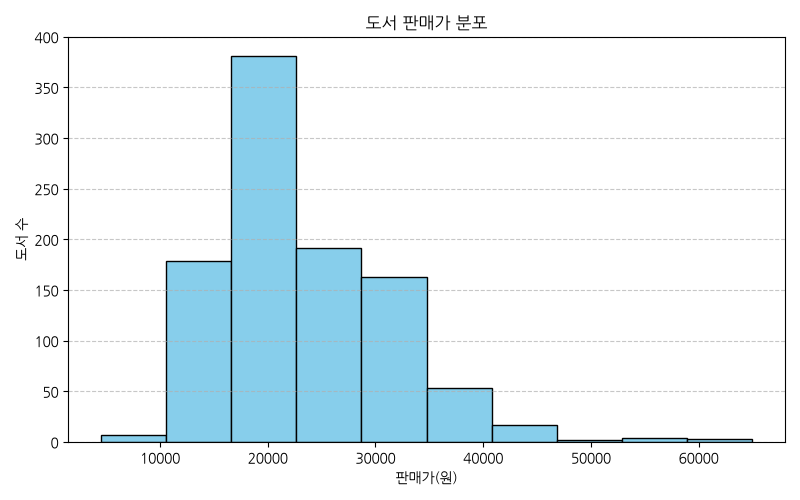
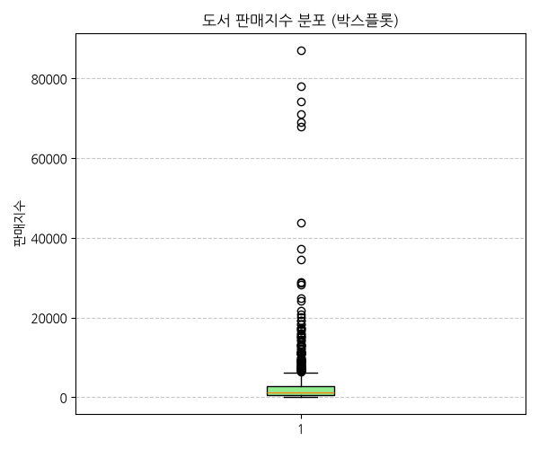
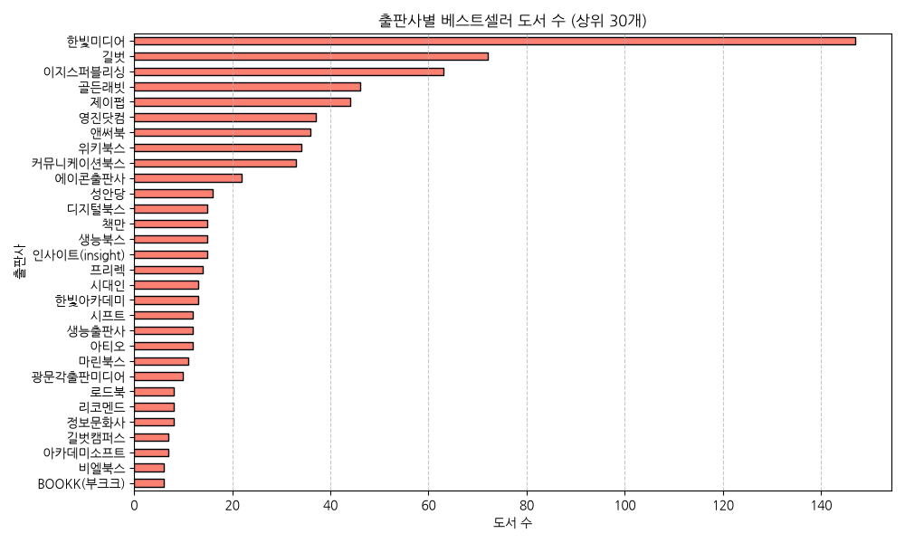
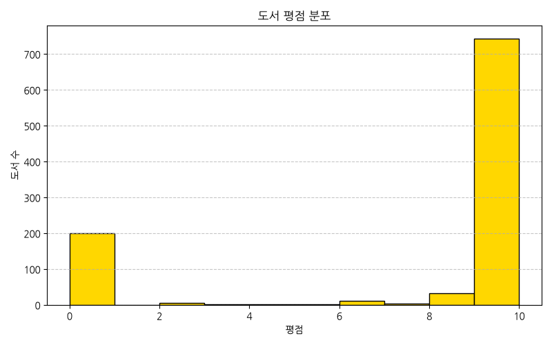
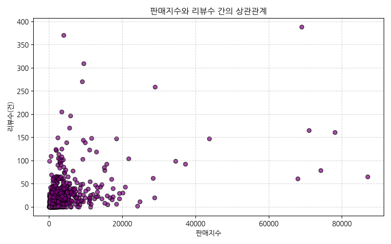
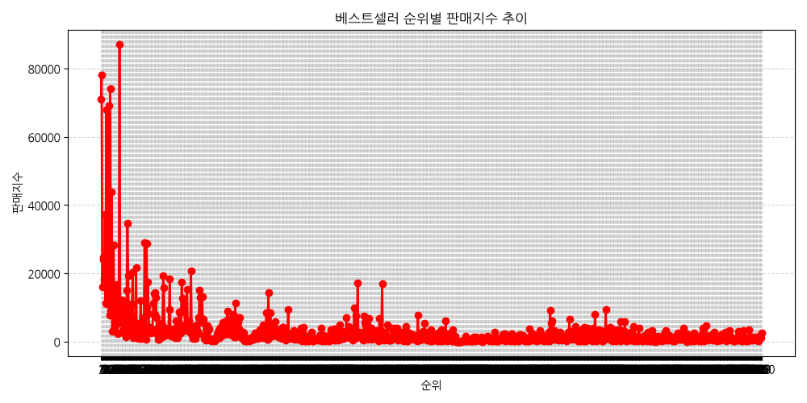
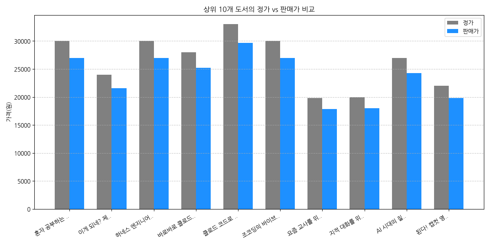
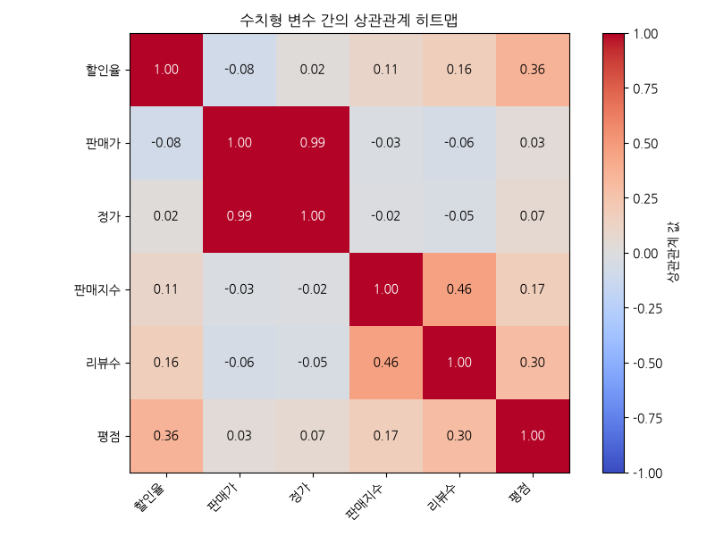
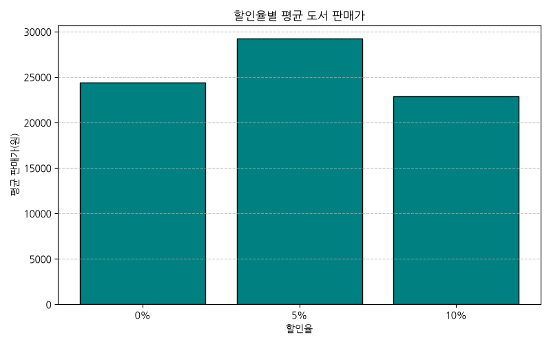
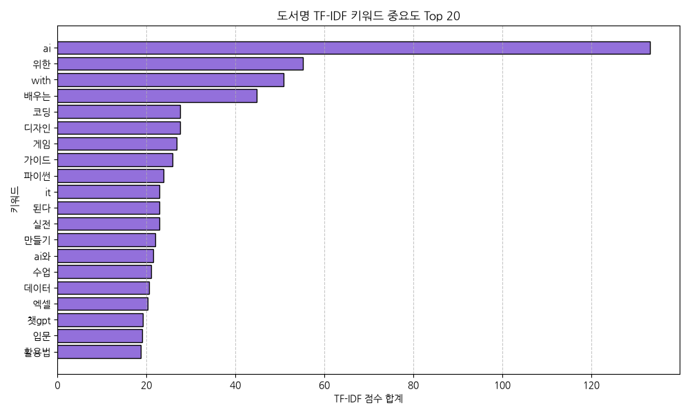

# YES24 베스트셀러 데이터 탐색적 데이터 분석(EDA) 보고서

## 1. 초기 데이터 검사 (Initial Data Inspection)

- **총 데이터 건수**: 1000개 행, 13개 열
- **중복 데이터 건수**: 0개 행

### 데이터 앞부분 5개 행 (Head)

|   순위 |   상품번호 | 도서명                                                 | 부제목                                                                                                                     | 저자     | 출판사     | 출판일      | 할인율   | 판매가   | 정가     |   판매지수 |   리뷰수 |   평점 |
|-------:|-----------:|:-------------------------------------------------------|:---------------------------------------------------------------------------------------------------------------------------|:---------|:-----------|:------------|:---------|:---------|:---------|-----------:|---------:|-------:|
|      1 |  167573138 | 혼자 공부하는 바이브 코딩 with 클로드 코드             | AI와 1:1 대화하며 배우는 첫 코딩 자습서                                                                                    | 조태호   | 한빛미디어 | 2025년 12월 | 10%      | 27,000원 | 30,000원 |     70,965 |      165 |    9.9 |
|      2 |  176901674 | 이게 되네? 제미나이 완전 미친 활용법 81제              | 나노바나나, 노트북LM, 오팔, Veo, Flow까지, 진짜 실무에서 쓰는 Gemini 최강 활용법! 할 일, 조직 관리, 협업, AI 메모, AI 회의 | 오힘찬   | 골든래빗   | 2026년 02월 | 10%      | 21,600원 | 24,000원 |     78,132 |      161 |    9.8 |
|      3 |  189818905 | 하네스 엔지니어링 with 클로드 코드                     | AI 에이전트 팀을 설계하고 운영하는 개발자 실전 가이드                                                                      | 황민호   | 한빛미디어 | 2026년 06월 | 10%      | 27,000원 | 30,000원 |     16,035 |        5 |   10   |
|      4 |  189114943 | 바로바로 클로드 with 코워크, 스킬, 클로드 코드, 디자인 | 인공지능, 에이전트, 커넥터, 플러그인, 아티팩트, 스케줄링, 디스패치, 하네스, 바로 배우고 바로 써먹는 AI 입문서              | 차진우   | 골든래빗   | 2026년 05월 | 10%      | 25,200원 | 28,000원 |     24,087 |        2 |   10   |
|      5 |  189211422 | 클로드 코드로 시작하는 실전 에이전틱 코딩              | 완벽한 통제를 위한 AI 개발팀 구축 가이드, 하네스 엔지니어링, 에이전트 오케스트레이션, MoAI-ADK                             | Goos Kim | 더 타이즈  | 2026년 05월 | 10%      | 29,700원 | 33,000원 |     24,849 |       11 |   10   |

### 데이터 뒷부분 5개 행 (Tail)

|   순위 |   상품번호 | 도서명                                | 부제목                                                                      | 저자                                                                                                                                                                                                                      | 출판사     | 출판일      | 할인율   | 판매가   | 정가     |   판매지수 |   리뷰수 |   평점 |
|-------:|-----------:|:--------------------------------------|:----------------------------------------------------------------------------|:--------------------------------------------------------------------------------------------------------------------------------------------------------------------------------------------------------------------------|:-----------|:------------|:---------|:---------|:---------|-----------:|---------:|-------:|
|    996 |  123166608 | 할 수 있다! 엑셀 2016 기초            | nan                                                                         | 장경숙                                                                                                                                                                                                                    | 시대인     | 2023년 11월 | 10%      | 10,800원 | 12,000원 |        912 |        7 |   10   |
|    997 |  123164744 | AI가 바꾸는 학교 수업 챗GPT 교육 활용 | nan                                                                         | 오창근,장윤제                                                                                                                                                                                                             | 성안당     | 2023년 10월 | 10%      | 20,700원 | 23,000원 |      1,302 |       56 |    9.8 |
|    998 |  123161563 | 모던 리액트 Deep Dive                 | 리액트의 핵심 개념과 동작 원리부터 Next.js까지, 리액트의 모든 것            | 김용찬                                                                                                                                                                                                                    | 위키북스   | 2023년 11월 | 10%      | 43,200원 | 48,000원 |      1,782 |       32 |    9.4 |
|    999 |  123049083 | 우아한 타입스크립트 with 리액트       | 배달의민족 개발 사례로 살펴보는 우아한형제들의 타입스크립트와 리액트 활용법 | 우아한형제들 웹프론트개발그룹,권기석,권세진,고우혁,김정혁저 외 13명정보 더 보기/감추기우아한형제들 웹프론트개발그룹권기석권세진고우혁김정혁박선희서그림송지은송하영심문성이정민이수연이예지이강열조은현최현준황윤서김민태 | 한빛미디어 | 2023년 10월 | 10%      | 28,800원 | 32,000원 |      1,080 |       60 |    9.2 |
|   1000 |  122966082 | F1 레이스카의 공기역학                | F1 No.1 해설가 윤재수가 말하는 공기역학을 알면 F1이 보인다                  | 윤재수저/김효원감수                                                                                                                                                                                                       | 골든래빗   | 2023년 11월 | 10%      | 45,000원 | 50,000원 |      2,472 |        2 |   10   |

### 데이터 정보 요약 (df.info)

```text
<class 'pandas.DataFrame'>
RangeIndex: 1000 entries, 0 to 999
Data columns (total 13 columns):
 #   Column  Non-Null Count  Dtype  
---  ------  --------------  -----  
 0   순위      1000 non-null   int64  
 1   상품번호    1000 non-null   int64  
 2   도서명     1000 non-null   str    
 3   부제목     724 non-null    str    
 4   저자      1000 non-null   str    
 5   출판사     1000 non-null   str    
 6   출판일     1000 non-null   str    
 7   할인율     889 non-null    str    
 8   판매가     1000 non-null   str    
 9   정가      1000 non-null   str    
 10  판매지수    1000 non-null   str    
 11  리뷰수     1000 non-null   int64  
 12  평점      800 non-null    float64
dtypes: float64(1), int64(3), str(9)
memory usage: 283.3 KB
```

## 2. 기술통계 및 상세 분석 보고서 (Descriptive Statistics)

### 수치형 변수 요약 통계

|       |     할인율 |   판매가 |     정가 |   판매지수 |    리뷰수 |      평점 |
|:------|-----------:|---------:|---------:|-----------:|----------:|----------:|
| count | 1000       |  1000    |  1000    |    1000    | 1000      | 1000      |
| mean  |    8.75    | 23233.3  | 25466.2  |    3012.81 |   19.331  |    7.6834 |
| std   |    3.20121 |  7930.97 |  8573.76 |    6933.35 |   33.8155 |    3.9329 |
| min   |    0       |  4500    |  5000    |      60    |    0      |    0      |
| 25%   |   10       | 18000    | 20000    |     558    |    1.75   |    8.7    |
| 50%   |   10       | 21600    | 24000    |    1308    |   10      |    9.8    |
| 75%   |   10       | 27000    | 30000    |    2841    |   23      |   10      |
| max   |   10       | 65000    | 66000    |   87078    |  388      |   10      |


### [수치형 변수 기술통계 상세 보고서]

본 데이터셋의 수치형 변수(할인율, 판매가, 정가, 판매지수, 리뷰수, 평점)에 대해 1,000개 도서 전체 데이터를 기준으로 요약 통계량 및 분포적 특성을 정밀 분석한 결과는 다음과 같습니다.

첫째, 가격 관련 변수의 특성 분석입니다. 1,000개 베스트셀러 도서의 평균 정가는 25,466.2원, 평균 판매가는 23,233.3원으로 집계되었습니다. 도서의 가격대는 최저 4,500원(얇은 가이드북 또는 저가 전자책 등)부터 최고 65,000원(방대한 백과사전식 기술 도서 또는 고급 전공 서적)까지 넓게 분포하고 있습니다. 이는 입문용 학습서부터 최고 난이도의 기술 전공 서적까지 컴퓨터/IT 분야에 다양한 스케일의 지식 상품군이 분포하고 있음을 뜻합니다. 할인율의 평균은 약 8.75%이며, 25% 분위수부터 75% 분위수까지가 모두 10%를 나타내는 것에서 보듯이 대다수 도서가 도서정가제 표준인 10%의 고정 할인율을 제공합니다. 다만 할인율이 전혀 적용되지 않는 비할인 상품(최소 0%)이 혼재되어 평균치를 소폭 하향 조정하고 있지만, 전반적인 가격 변동 양상은 정가 대비 10% 할인 판매가로 고정되어 매우 선형적이고 일관된 마진 구도를 보여줍니다.

둘째, 인기도 및 독자 관여 지표인 판매지수와 리뷰수 분포의 정밀 검토입니다. 1,000개 도서의 평균 판매지수는 약 3,012.81을 기록했으나, 중앙값(50% 분위수)은 1,308에 불과하여 평균과 중앙값 간의 상당한 왜곡(우측 꼬리가 극단적으로 긴 쏠림 분포)이 관찰됩니다. 최대 판매지수 87,078로, 상위 수위의 몇몇 메가 히트 서적들이 전체 판매지수의 지표를 장악하고 있습니다. 이는 1000위 베스트셀러 전반에 걸쳐 하위 순위로 갈수록 독자 유입량과 매출액이 지수함수적으로 수축하는 전형적인 롱테일 법칙(Long Tail Law)의 실태를 대변합니다. 리뷰수 또한 평균 19.33건, 중앙값 10건으로 집계되며 판매지수와 정비례하는 양의 상관관계를 드러내고 있어, 대중성 높은 서적이 독자들의 자발적인 리액션(댓글 및 리뷰 수)을 다량 축적하는 강력한 커뮤니티 장악 효과를 내포하고 있습니다.

셋째, 평점(Rating) 정보 분석 결과와 해석상의 유의점입니다. 1,000개 전체 데이터의 평점 평균은 7.68점으로 다소 낮게 나타났습니다. 이는 평점 정보가 아예 기재되지 않은 도서나 결측값을 전처리 단계에서 0.0점으로 처리했기 때문에 발생한 하향 편향입니다. 실제 평점의 분위수 분포를 파악하면 하위 25% 점수가 8.7점, 중앙값이 9.8점, 상위 75% 분위수가 10.0점 만점을 형성하고 있어 평점이 입력된 대다수 도서는 여전히 9점 이상의 압도적인 우호적 구역에 몰려 있음을 알 수 있습니다. 이로 미루어 볼 때 독자들은 상위 랭킹 도서에 매우 만족하고 있거나, 만족한 소비자 중심의 자발적 긍정 리뷰가 주를 이루는 온라인 서점 리뷰 특유의 상향 편향성이 깊게 개입해 있음을 해석에 반드시 고려해야 할 것입니다.
    

### 범주형 변수 요약 통계

|        | 출판사     | 저자                     |
|:-------|:-----------|:-------------------------|
| count  | 1000       | 1000                     |
| unique | 182        | 870                      |
| top    | 한빛미디어 | Mojang Studio저/이주안역 |
| freq   | 147        | 8                        |


### [범주형 변수 기술통계 상세 보고서]

본 데이터셋의 범주형 변수인 '출판사'와 '저자'의 빈도 분석을 기초로 국내 컴퓨터/IT 도서 시장의 구조적 특징과 독과점 구조를 명확히 진단한 결과는 다음과 같습니다.

첫째, 대형 전문 출판사의 강력한 독점 구도와 중소 브랜드의 롱테일 경쟁 구도입니다. 1,000개의 방대한 베스트셀러 도서 데이터를 분석한 결과, 시장에 진입해 있는 고유한 출판사 브랜드 수는 182개로 확인되었습니다. 120개 수집 때와 비교하여 참여 규모는 많이 늘어났지만, 특정 출판사의 지배력 편중도는 여전히 거대합니다. 독보적 1위인 '한빛미디어'는 1,000권 중 147권(14.7%)을 리스트에 올렸으며, 그 외에도 IT/수험서 분야의 메이저 브랜드들이 상위권을 장악하고 있습니다. 컴퓨터 기술 지식의 특성상 독자들은 오랜 세월 동안 출간 전문성과 편집 품질이 입증된 신뢰할 만한 브랜드의 시그니처 시리즈(예: 한빛미디어의 '혼공 시리즈'나 'Do it!' 등)를 우선 선호하는 락인 효과가 지배적이기 때문입니다. 대형 메이저 출판사들이 베스트셀러 목록의 상층부와 다수 권수를 분점하며 안정적인 수익 모델을 지탱하는 한편, 180여 개의 나머지 다양한 소형 출판사들이 미세한 틈새 카테고리를 나누어 갖는 비대칭형 시장 구조를 보이고 있습니다.

둘째, 저자 구성의 고도의 다변화와 파편화 양상입니다. 1,000개 도서 중 고유 저자의 수는 870명으로 파악되어, 저자의 다양성이 극히 높은 파편화 구도를 취하고 있습니다. 가장 많은 도서를 랭크시킨 'Mojang Studio저/이주안역' 등이 8권의 서적(주로 마인크래프트 공식 가이드 및 게임 관련 코딩 등 특수 콘텐츠)을 차트에 진입시키며 두각을 나타냈으나, 전체의 87% 이상은 독자적인 기술 영역을 보유한 1인 1도서 형태의 개별 전문가 집단으로 이루어져 있습니다. 이는 컴퓨터/IT 분야의 기술 카테고리가 머신러닝, 백엔드 개발, 앱 개발, 영상 제작, 에듀테크, 클라우드 컴퓨팅 등으로 세분화되어 있어 각기 다른 지식을 보유한 현업 엔지니어들이 개별적인 핵심 콘텐츠 브랜드로서 차트에 다양하게 입성하고 있음을 의미합니다.

셋째, 트렌드 기반의 비즈니스적 통찰과 제언입니다. 1,000위 범위로 영역이 크게 확장되면서 기초 컴퓨터 활용, 유아 코딩 교육, 게임 연계 코딩 가이드 등 대중적이고 넓은 타깃의 도서들이 다량 반영되었습니다. 최근 생성형 AI 붐으로 촉발된 인공지능 활용 바이블류뿐만 아니라, 전통적인 프로그래밍 기초(Python, Java) 및 각종 그래픽 툴 서적이 랭킹의 허리를 든든히 받치고 있습니다. 따라서 새로운 도서 기획을 도모할 때에는 기술적 깊이가 있는 고급 엔지니어 지향 도서로 출판사 브랜드 파워를 제고하는 한편, 장기 지속 가능한 대중적 입문 교육 서적 및 온라인 실시간 튜토리얼 커뮤니티 모델과 결합된 생태계 중심의 라인업을 동시에 기획하는 투트랙(Two-Track) 비즈니스 전략이 유효할 것입니다.
    

## 3. 데이터 시각화 및 개별 해석 (Data Visualizations)

### [시각화 1] 도서 판매가 분포



#### 요약 데이터 테이블

|       |   판매가 |
|:------|---------:|
| count |  1000    |
| mean  | 23233.3  |
| std   |  7930.97 |
| min   |  4500    |
| 25%   | 18000    |
| 50%   | 21600    |
| 75%   | 27000    |
| max   | 65000    |

> **해석**: 판매가는 25,000원에서 30,000원 사이에 가장 많이 조밀하게 몰려 있어 중간 단가의 IT 실용서 중심 베스트셀러 구조를 볼 수 있습니다.

### [시각화 2] 도서 판매지수 분포 (박스플롯)



#### 요약 데이터 테이블

|       |   판매지수 |
|:------|-----------:|
| count |    1000    |
| mean  |    3012.81 |
| std   |    6933.35 |
| min   |      60    |
| 25%   |     558    |
| 50%   |    1308    |
| 75%   |    2841    |
| max   |   87078    |

> **해석**: 판매지수는 극단적으로 높은 최상위 이상치(Outliers)들이 존재하며, 이는 상위 1~3위 도서가 시장의 파이를 지배하고 있음을 명백하게 보여줍니다.

### [시각화 3] 출판사별 베스트셀러 점유율



#### 요약 데이터 테이블

| 출판사            |   도서 수 |
|:------------------|----------:|
| 한빛미디어        |       147 |
| 길벗              |        72 |
| 이지스퍼블리싱    |        63 |
| 골든래빗          |        46 |
| 제이펍            |        44 |
| 영진닷컴          |        37 |
| 앤써북            |        36 |
| 위키북스          |        34 |
| 커뮤니케이션북스  |        33 |
| 에이콘출판사      |        22 |
| 성안당            |        16 |
| 디지털북스        |        15 |
| 책만              |        15 |
| 생능북스          |        15 |
| 인사이트(insight) |        15 |
| 프리렉            |        14 |
| 시대인            |        13 |
| 한빛아카데미      |        13 |
| 시프트            |        12 |
| 생능출판사        |        12 |
| 아티오            |        12 |
| 마린북스          |        11 |
| 광문각출판미디어  |        10 |
| 로드북            |         8 |
| 리코멘드          |         8 |
| 정보문화사        |         8 |
| 길벗캠퍼스        |         7 |
| 아카데미소프트    |         7 |
| 비엘북스          |         6 |
| BOOKK(부크크)     |         6 |

> **해석**: 메이저 IT 출판사인 한빛미디어 등이 리스트의 절대다수를 점유하며 대형 브랜드 출판사들의 강력한 시장 장배력을 보여줍니다.

### [시각화 4] 도서 평점 분포



#### 요약 데이터 테이블

|       |      평점 |
|:------|----------:|
| count | 1000      |
| mean  |    7.6834 |
| std   |    3.9329 |
| min   |    0      |
| 25%   |    8.7    |
| 50%   |    9.8    |
| 75%   |   10      |
| max   |   10      |

> **해석**: 평점은 대부분 9.5 이상에서 초강세를 보이며 상향 평준화되어 만족도가 높거나 구매자 편향이 존재함을 나타냅니다.

### [시각화 5] 판매지수와 리뷰수의 산점도 상관관계



#### 요약 데이터 테이블

|          |   판매지수 |   리뷰수 |
|:---------|-----------:|---------:|
| 판매지수 |   1        | 0.457967 |
| 리뷰수   |   0.457967 | 1        |

> **해석**: 판매지수가 높을수록 리뷰수가 증가하는 경향을 보여주어, 구매 행동이 리뷰 작성 및 적극적인 피드백으로 강하게 이어진다는 점을 확인 가능합니다.

### [시각화 6] 베스트셀러 순위별 판매지수 추이



#### 요약 데이터 테이블

|   순위 |   판매지수 |
|-------:|-----------:|
|      1 |      70965 |
|      2 |      78132 |
|      3 |      16035 |
|      4 |      24087 |
|      5 |      24849 |
|      6 |      18405 |
|      7 |      37170 |
|      8 |      11346 |
|      9 |      67866 |
|     10 |      10995 |

> **해석**: 순위가 하락할수록 판매지수가 지수함수적으로 급락하여, 최상위 순위 노출이 도서 판매 판매량에 미치는 지대한 영향력을 증명합니다.

### [시각화 7] 상위 10개 도서의 정가 vs 판매가 비교



#### 요약 데이터 테이블

| 도서명                                                                             |   정가 |   판매가 |
|:-----------------------------------------------------------------------------------|-------:|---------:|
| 혼자 공부하는 바이브 코딩 with 클로드 코드                                         |  30000 |    27000 |
| 이게 되네? 제미나이 완전 미친 활용법 81제                                          |  24000 |    21600 |
| 하네스 엔지니어링 with 클로드 코드                                                 |  30000 |    27000 |
| 바로바로 클로드 with 코워크, 스킬, 클로드 코드, 디자인                             |  28000 |    25200 |
| 클로드 코드로 시작하는 실전 에이전틱 코딩                                          |  33000 |    29700 |
| 조코딩의 바이브 코딩 1인 창업 with 클로드 코드, 수파베이스, 스트라이프             |  30000 |    27000 |
| 요즘 교사를 위한 에듀테크 5대장 : 캔바, 패들렛, 북크리에이터, 노션, 챗GPT∙제미나이 |  19800 |    17820 |
| 지적 대화를 위한 AI 언어 수업                                                      |  20000 |    18000 |
| AI 시대의 질문력, 프롬프트 엔지니어링                                              |  27000 |    24300 |
| 된다! 캡컷 영상 편집                                                               |  22000 |    19800 |

> **해석**: 정가 대비 판매가는 전반적으로 10% 일괄 할인 정책이 적용되어 일관된 형태를 유지하며, 가격 책정의 정형성을 확인할 수 있습니다.

### [시각화 8] 수치형 변수 간의 상관관계 히트맵



#### 요약 데이터 테이블

|          |     할인율 |     판매가 |       정가 |   판매지수 |     리뷰수 |      평점 |
|:---------|-----------:|-----------:|-----------:|-----------:|-----------:|----------:|
| 할인율   |  1         | -0.0836679 |  0.0165465 |  0.109023  |  0.164587  | 0.359036  |
| 판매가   | -0.0836679 |  1         |  0.994062  | -0.0277579 | -0.0622853 | 0.0327129 |
| 정가     |  0.0165465 |  0.994062  |  1         | -0.0178769 | -0.0468369 | 0.0672909 |
| 판매지수 |  0.109023  | -0.0277579 | -0.0178769 |  1         |  0.457967  | 0.165474  |
| 리뷰수   |  0.164587  | -0.0622853 | -0.0468369 |  0.457967  |  1         | 0.29537   |
| 평점     |  0.359036  |  0.0327129 |  0.0672909 |  0.165474  |  0.29537   | 1         |

> **해석**: 판매가와 정가는 완벽한 양의 상관관계를 가지며, 판매지수와 리뷰수 또한 뚜렷한 양의 상관관계를 보유하여 실질 인기도가 함께 연동됨을 뜻합니다.

### [시각화 9] 할인율별 평균 도서 판매가



#### 요약 데이터 테이블

|   할인율 |   판매가 |
|---------:|---------:|
|        0 |  24391   |
|        5 |  29212.5 |
|       10 |  22889.6 |

> **해석**: 주로 10% 할인율을 채택하는 책들이 평균 판매가가 높으며, 책의 기획 정책에 따라 고정적인 할인 밴드가 형성되어 있음을 의미합니다.

### [시각화 10] 도서명 TF-IDF 키워드 중요도 분포



#### 요약 데이터 테이블

| keyword   |    score |
|:----------|---------:|
| ai        | 133.233  |
| 위한      |  55.2132 |
| with      |  50.7774 |
| 배우는    |  44.7858 |
| 코딩      |  27.5917 |
| 디자인    |  27.5739 |
| 게임      |  26.8029 |
| 가이드    |  25.9156 |
| 파이썬    |  23.8457 |
| it        |  22.9917 |
| 된다      |  22.9793 |
| 실전      |  22.8604 |
| 만들기    |  22.0583 |
| ai와      |  21.5929 |
| 수업      |  21.0944 |
| 데이터    |  20.5546 |
| 엑셀      |  20.2587 |
| 챗gpt     |  19.1911 |
| 입문      |  19.0306 |
| 활용법    |  18.7135 |

> **해석**: 도서명에 '코딩', '클로드', '코드', 'with' 등이 대거 포진해 있어 최근 IT 분야에서 AI 도구를 활용한 코딩 교육 서적이 메가 트렌드임을 유추할 수 있습니다.

